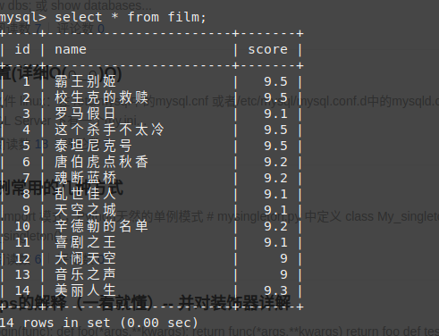

##### mysql中的group_concat

- 基本用法
group_concat([DISTINCT] 要连接的字段 [Order BY ASC/DESC 排序字段] [Separator '分隔符'])
-  简单示例
建表
```sql
create table film(
  id int primary key auto_increment,
  name varchar (128),
  score float
);
```
插入数据
```sql
insert into film(name,score)values
('霸王别姬',9.5),
('校生克的救赎',9.5),
('罗马假日',9.1),
('这个杀手不太冷',9.5),
('泰坦尼克号',9.5),
('唐伯虎点秋香',9.2),
('魂断蓝桥',9.2),
('乱世佳人',9.1),
('天空之城',9.1),
('辛德勒的名单',9.2),
('喜剧之王',9.1),
('大闹天空',9.0),
('音乐之声',9.0),
('美丽人生',9.3)
```



这是想查询每个评分有哪些电影，就可以使用group_concat了


##### group_concat的最大值限制
- group_concat() 是有最大长度限制的，默认值是 1024
- 可以通过 group_concat_max_len 参数进行动态设置。参数范围可以是 Global 或 Session
```sql
set [global | session] group_concat_max_len = val;
```
值是无符号的整型，最大值与版本位数有关
版本 | 最小值 | 最大值 
------ | ------ | ------
 32位 | 4 | 4294967295
 64位 | 4 |18446744073709551615

如果 group_concat_max_len 的值被设置为小等于 512，那么 GROUP_CONCAT 的返回值类型是 VARCHAR 或 VARBINARY；否则是 TEXT 或 BLOB

- 也可以这样设置
```sql
set session group_concat_max_len=18446744073709551615;
```

##### Django 中ORM实现group_concat

- 创建对应的model
```sql
from django.db import models
from django.db.models import Aggregate, CharField
# Create your models here.


class Film(models.Model):
    name = models.CharField(max_length=128)
    score = models.FloatField

    class Meta:
        db_table = 'film'


class Concat(Aggregate):
    """ORM用来分组显示其他字段 相当于group_concat"""
    function = 'GROUP_CONCAT'
    template = '%(function)s(%(distinct)s%(expressions)s)'

    def __init__(self, expression, distinct=False, **extra):
        super(Concat, self).__init__(
            expression,
            distinct='DISTINCT ' if distinct else '',
            output_field=CharField(),
            **extra)
```
**进入shell环境操作一下**
- 通过评分分组，并将电影(name)通过 , 连接起来（默认是逗号也可以自定义）
```shell
(test) (base) tj001@t-Ubuntu:~/code/test/group_concat$ python manage.py shell
Python 3.6.7 (default, Oct 22 2018, 11:32:17) 
[GCC 8.2.0] on linux
Type "help", "copyright", "credits" or "license" for more information.
(InteractiveConsole)
>>> from app.models import Film,Concat
>>> result = Film.objects.values('score').annotate(film_name=Concat('name'))
>>> result
<QuerySet [{'score': 9.0, 'film_name': '大闹天空,音乐之声'}, {'score': 9.1, 'film_name': '罗马假日,乱世佳人,天空之城,喜剧之王'}, {': '唐伯虎点秋香,魂断蓝桥,辛德勒的名单'}, {'score': 9.3, 'film_name': '美丽人生'}, {'score': 9.5, 'film_name': '霸王别姬,校生克的救赎,这个杀手不太冷,泰坦尼克号'}]>
>>> 

```
