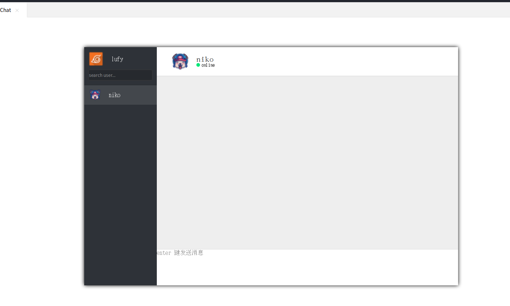
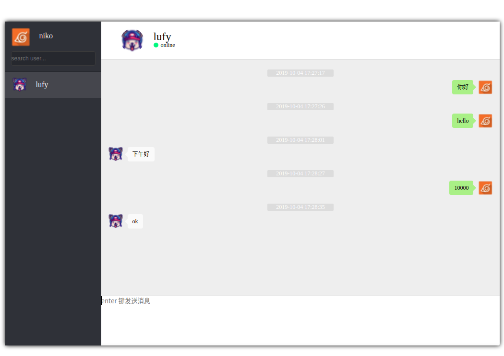

#### 前端
- 建立`ws`连接
**封装一个ws类，建立ws每次只需要实例化这个即可**
```javascript

 var NEW_WEBSOCKET = function (room) {
            var self = this
            self.url = 'ws://' + window.location.host + '/ws/chat/' + room + '/';
            self.be_ws_name = '';
            self.servce_id = ''
            //初始化websocket, 建立连接, 定义各个函数
            self.init_ws = function (fun) {
                self.msg_fun = fun
                window.WebSocket = window.WebSocket || window.MozWebSocket;

                if (!window.WebSocket) { // 检测浏览器支持
                    console.error('错误: 浏览器不支持websocket');
                    return;
                }
                self.ws = new WebSocket(self.url);
                console.log('连接已建立，房间：', room);

                self.ws.onopen = function (res) {
                    console.log('连接成功');
                };

                self.ws.onclose = function (res) {
                    console.log("连接已断开");
                };

                self.ws.onmessage = function (res) {
                    var data = JSON.parse(res.data);
                    console.log('data--------', data, typeof (data))
                    let message = data.message.text;
                    if (data.message.sender_type == 4) {
                        self.close_connect();
                        return
                    }
                    if (data.message.sender_type == 2 && data.message.to_user == app.username) {
                        console.log(app.username, '收到', data.message.promoter, '的chat消息')
                        if (self.be_ws_name != data.message.promoter) {
                            self.be_ws_name = data.message.promoter
                            app.ws_passageway = true
                            app.chat_ws_connect(data.message.promoter)
                        }

                    }
                    if (data.message.sender_type != 2 && data.message.sender_type != 3) {
                        if (data.message.username == app.username) {
                            app.append_msg_node(data.message.text, 'me')
                        } else {
                            app.append_msg_node(data.message.text, 'he')
                        }
                        return
                    }


                };
                self.ws.onerror = function (err) {
                    console.log("连接WebSocket失败:", err)
                };

                window.onbeforeunload = function (e) {
                    try {
                        console.log("页面退出，关闭连接");
                        self.close_connect()
                    } catch (e) {
                        console.log("关闭连接出错：", e)
                    }
                    e.returnValue = ''
                }

            };
            self.article_send_msg = function (msg_obj) {
                // 发送消息
                self.ws.send(JSON.stringify({
                    message: msg_obj
                }));


            };

            self.close_connect = function () {
                self.ws.close();
                console.log('断开连接...');

            }


        };

```

**示例：**
```javascript
 // 公共房间  传入的参数为ws连接的标志
  self.ws_obj = new NEW_WEBSOCKET(self.public_room)
  self.ws_obj.init_ws()
```

##### 后端交给channels处理
[这里是它的官网](https://channels.readthedocs.io/en/latest/)
里面有一个教程 就是实现基本的聊天
```python
# chat/consumers.py
from asgiref.sync import async_to_sync
from channels.generic.websocket import WebsocketConsumer
import json


class ChatConsumer(WebsocketConsumer):
    def connect(self):
        self.room_name = self.scope['url_route']['kwargs']['room_name']
        self.room_group_name = 'chat_%s' % self.room_name
        print('房间', self.room_name)

        # Join room group
        async_to_sync(self.channel_layer.group_add)(
            self.room_group_name,
            self.channel_name
        )

        self.accept()

    def disconnect(self, close_code):
        # Leave room group
        async_to_sync(self.channel_layer.group_discard)(
            self.room_group_name,
            self.channel_name
        )

    # Receive message from WebSocket
    def receive(self, text_data):
        text_data_json = json.loads(text_data)
        message = text_data_json['message']
        print('收到的消息：',message)

        # Send message to room group
        async_to_sync(self.channel_layer.group_send)(
            self.room_group_name,
            {
                'type': 'chat_message',
                'message': message
            }
        )
        print(f'{self.room_group_name}发送的消息：',message)

    # Receive message from room group
    def chat_message(self, event):
        message = event['message']

        # Send message to WebSocket
        self.send(text_data=json.dumps({
            'message': message
        }))

```

##### 效果如下
- 用户`lufy `好友`niko`在线


- `lufy`收到`niko`的消息


- 互相发送消息



- 这里的消息 做了`sessionStorage`消息存储 刷新后会显示历史消息


#### tips
- 这里的用户头像我在前端写死的(本来想自定义的,但毕竟是一个demo，就没有做)
- 这里的好友列表是存在redis里的
- redis里的数据没有。。。
- 代码已放置[GitHub](https://github.com/chongjing001/Python-Advance/tree/master/DemoCode/sp_test)