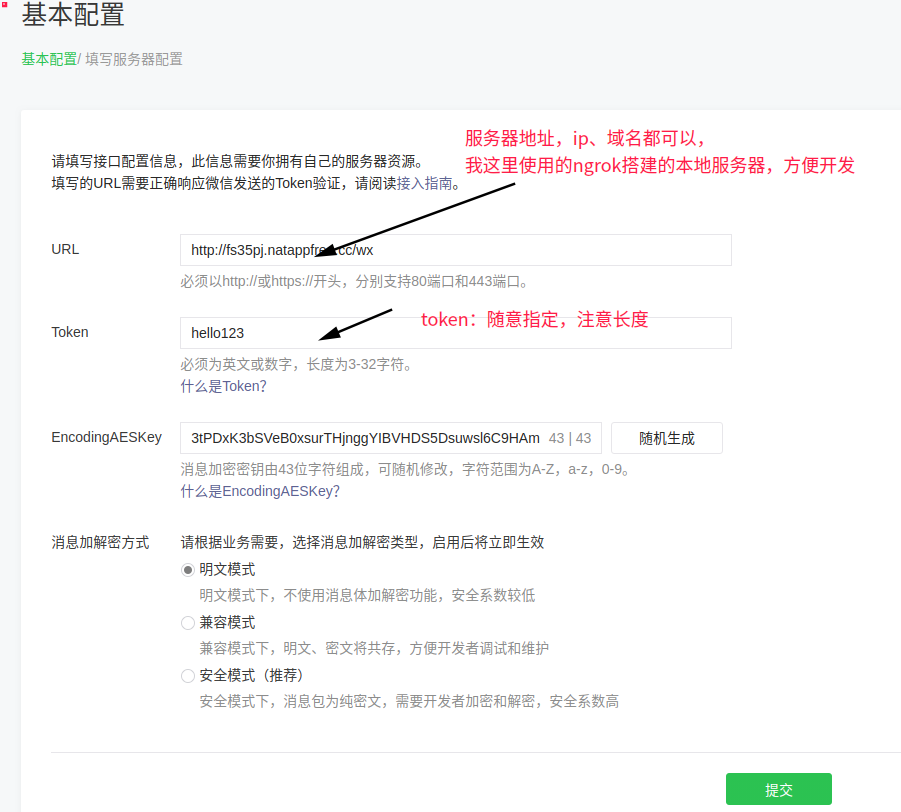
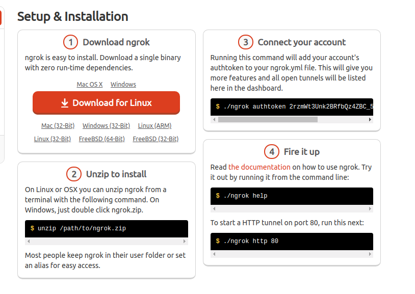
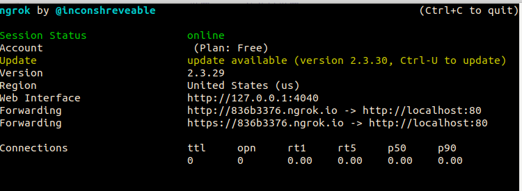

#####  微信公众平台配置
(官网)[https://mp.weixin.qq.com/]
- 1.注册
- 2.登录
- 3.公众号基本信息填写:
	- 设置 --> 公众号设置

**4.接入配置**
	开发 --> 基本配置
(官方文档-入门指引)[https://mp.weixin.qq.com/wiki?t=resource/res_main&id=mp1472017492_58YV5]
进入基本配置---> 修改配置(填写服务器配置)



- 5.使用ngrok
官网`https://ngrok.com/`注册登录一下(可以使用Github快速注册登录)
[linux使用方法]



启动成功后如下：



ps：为方便每次启动，可以创建一个shell脚本，将上面图片的3,4步粘贴即可

##### 配置web服务器
这里使用django配置web服务(其他web框架同理)
>需要的三方包
>django  2.1.7
>lxml
暂时需要这些，后面根据功能再加

- 路由`urls.py`配置
`path('wx', views.init_connet),`
- 创建一个应用
示例：`python manage.py startapp connet`
****
**思路：**


****

- connet中的`views.py`配置
```python
from django.http import HttpResponse
# Create your views here.
import hashlib

from utils import receive, reply,reply_help


def init_connet(request):
    if request.method == 'GET':
        try:
            if len(request.GET) == 0:
                return "hello, this is handle view"
            token = 'hello123'  # 注意和配置页面的token一样
            signature = request.GET.get('signature', '')
            timestamp = request.GET.get('timestamp', '')
            nonce = request.GET.get('nonce', '')
            echostr = request.GET.get('echostr', '')
            s = [timestamp, nonce, token]
            s.sort()
            s = ''.join(s)
            sha1 = hashlib.sha1(s.encode('utf-8'))
            hashcode = sha1.hexdigest()
            print("handle/GET func: hashcode, signature: ", hashcode, signature)
            if hashcode == signature:
                print('====验证通过====')
                return HttpResponse(echostr)
            else:
                print('====验证失败====')
                return ""
        except Exception as e:
            print('===error===', e)
            return e
```

**将`http://836b3376.ngrok.io/wx`填入配置页面的URL**
EncodingAESKey选择随机生成就好

- 启动项目
	- 1.`settings.py`文件
	`ALLOWED_HOSTS = ['*']`
	- 2.`python manage.py runserver 0.0.0.0:80`
	必须以80端口启动项目
- 点击 提交按钮 验证配置


