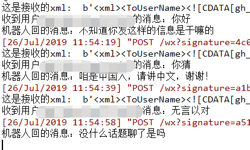
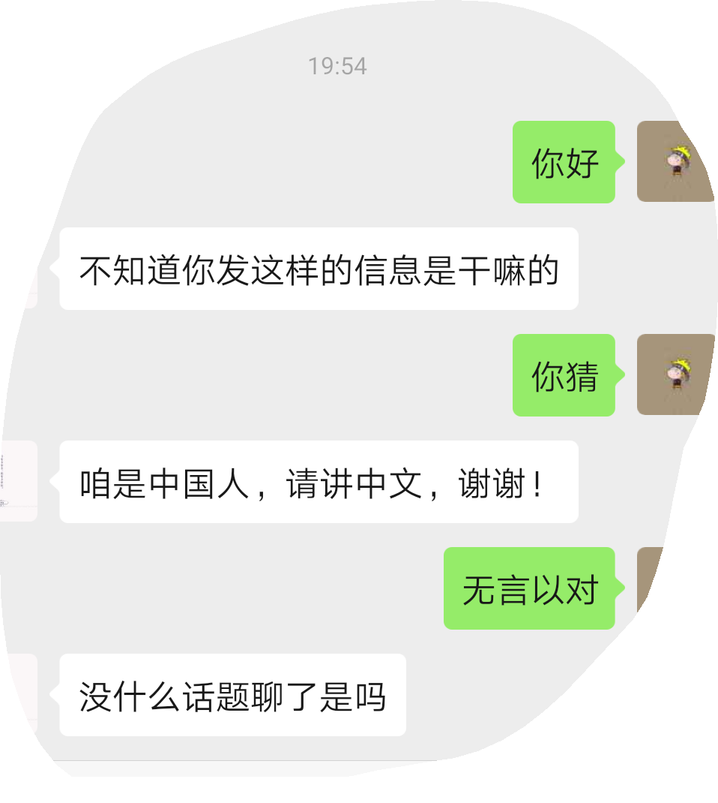

##### 回复消息自定义

**这里调用网上找到的聊天api接口**

- `reply_help.py`文件
```python
import json
import random
import time
import urllib.request
import requests

def tl_reply(text_input):
    """
    图灵机器人api
    :param text_input:
    :return:
    """
    api_url = "http://openapi.tuling123.com/openapi/api/v2"

    req = {
        "perception":
            {
                "inputText":
                    {
                        "text": text_input
                    },

                "selfInfo":
                    {
                        "location":
                            {
                                "city": "成都",
                                "province": "四川",
                                "street": "天府三街"
                            }
                    }
            },

        "userInfo":
            {
                "apiKey": "你的apikey",
                "userId": "OnlyUseAlphabet"
            }
    }
    # print(req)
    # 将字典格式的req编码为utf8
    req = json.dumps(req).encode('utf8')
    # print(req)

    http_post = urllib.request.Request(api_url, data=req, headers={'content-type': 'application/json'})
    response = urllib.request.urlopen(http_post)
    response_str = response.read().decode('utf8')
    # print(response_str)
    response_dic = json.loads(response_str)
    # print(response_dic)

    intent_code = response_dic['intent']['code']
    results_text = response_dic['results'][0]['values']['text']
    print('Turing的回答：')
    print('code：' + str(intent_code))
    print('text：' + results_text)
    return results_text


def qyk_reply(text_input):
    """
    青云客智能聊天机器人API
    :param text_input: 用户的问题
    :return: 机器人回答
    """
    api_url = f'http://api.qingyunke.com/api.php?key=free&appid=0&msg={text_input}'
    http_post = urllib.request.Request(api_url, headers={'content-type': 'application/json'})
    response = urllib.request.urlopen(http_post)
    response_str = response.read().decode('utf8')
    # print(json.loads(response_str))
    # print(type(json.loads(response_str)))
    return json.loads(response_str)['content']


def tx_reply(text_input):
    """
    腾讯闲聊机器人api
    :param text_input:
    :return:
    """
    # 请求参数配置
    app_id = '' # 你的app_id
    time_stamp = time.time()
    nonce_str = 'ffd54f5' + str(random.randint(0, 5512))
    sign = 'abcd' * 8
    session = '10000'
    question = text_input

    api_url = f'https://api.ai.qq.com/fcgi-bin/nlp/nlp_textchat?app_id={app_id}&time_stamp={time_stamp}&nonce_str={nonce_str}&sign={sign}&session={session}&question={question}'
    url = api_url

    response = requests.get(url)
    if response.status_code == 200:
        print(response.content.decode('utf-8'))
    print('*******************',response)

```

- 视图函数
```python
from django.shortcuts import render
from django.http import HttpResponse
# Create your views here.
import hashlib

from utils import receive, reply,reply_help


def init_connet(request):
    if request.method == 'GET':
        try:
            if len(request.GET) == 0:
                return "hello, this is handle view"
            token = 'hello123'
            signature = request.GET.get('signature', '')
            timestamp = request.GET.get('timestamp', '')
            nonce = request.GET.get('nonce', '')
            echostr = request.GET.get('echostr', '')
            s = [timestamp, nonce, token]
            s.sort()
            s = ''.join(s)
            sha1 = hashlib.sha1(s.encode('utf-8'))
            # map(sha1.update, s)
            hashcode = sha1.hexdigest()
            print("handle/GET func: hashcode, signature: ", hashcode, signature)
            if hashcode == signature:
                print('====验证通过====')
                return HttpResponse(echostr)
            else:
                print('====验证失败====')
                return ""
        except Exception as e:
            print('===error===', e)
            return e
    if request.method == 'POST':
        # print(request.body.decode())
        webData = request.body
        print('这是接收的xml: ',webData)
        recMsg = receive.parse_xml(webData)
        if isinstance(recMsg, receive.Msg) and recMsg.MsgType == 'text':
            toUser = recMsg.FromUserName
            fromUser = recMsg.ToUserName
            content = recMsg.Content.decode('utf8')
            print(f'收到用户[{fromUser}]的消息：{content}')
            try:
                content = reply_help.qyk_reply(recMsg.Content) # 这里调用的时青云客api
                # content = reply_help.tx_reply(content)
            except Exception as e:
                print(e)
            print(f'机器人回的消息：{content}')
            replyMsg = reply.TextMsg(toUser, fromUser, content)
            return HttpResponse(replyMsg.send())

        else:
            print("暂且不处理")
            return HttpResponse('')


```

**打印的日志**


**微信-公总号端**




> 青云客智能聊天机器人API 可以正常使用 但能回复的能较少
> 图灵api--坑  注册后现在要实名认证后才能调用(它这里实名认证超麻烦，就没弄)

> 这里是根据官方文档的web.py框架改的Django(其他web服务端也差不多吧)---记录一下吧！

> 整个测试demo代码(Python-Advance/DemoCode)
**待续...**