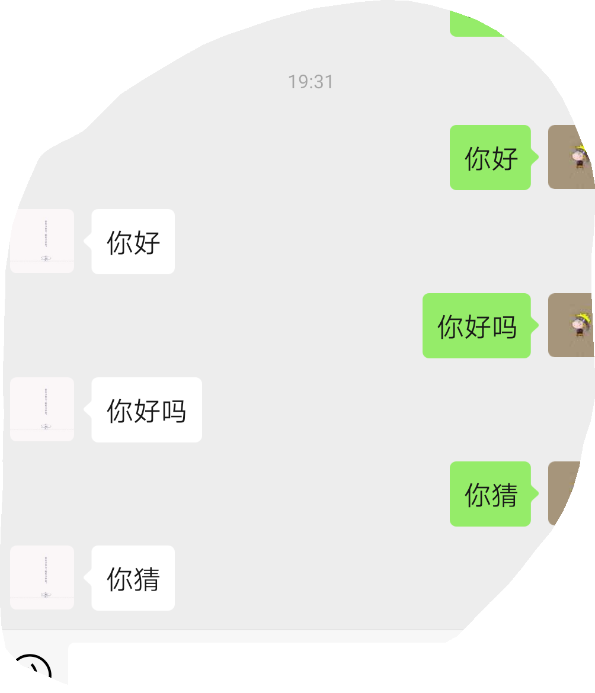

#### 收发消息记录

##### 接收用户发送的消息
- 这里以文本消息示例

> 收到公众平台发送的xml 如下：（下文均隐藏了ToUserName 及 FromUserName 信息）

```
<xml>
<ToUserName><![CDATA[公众号]]></ToUserName>
 <FromUserName><![CDATA[粉丝号]]></FromUserName>
 <CreateTime>1460537339</CreateTime>
 <MsgType><![CDATA[text]]></MsgType>
 <Content><![CDATA[欢迎开启公众号开发者模式]]></Content>
 <MsgId>6272960105994287618</MsgId>
 </xml>
```
> **说明**
>createTime 是微信公众平台记录粉丝发送该消息的具体时间
>text: 用于标记该xml 是文本消息，一般用于区别判断
>欢迎开启公众号开发者模式: 说明该粉丝发给公众号的具体内容是欢迎开启公众号开发者模式
>MsgId: 是公众平台为记录识别该消息的一个标记数值, 微信后台系统自动产生

- 1.基本接收代码
```python
def init_connet(request):
    if request.method == 'GET':
        pass
        # 这里是之前实现接入的代码，就省略了
    if request.method == 'POST':
        # print(request.body.decode())
        webData = request.body
        print('这是接收的xml: ',webData)
        recMsg = receive.parse_xml(webData)
        if isinstance(recMsg, receive.Msg) and recMsg.MsgType == 'text':
            return HttpResponse('')
        else:
            print("暂且不处理")
            return HttpResponse('')
```
在公众号中发一条消息
上面的`webData`就是接收的xml，可以拿到发送者的信息

> 若服务器无法保证在五秒内处理回复，则必须回复“success”或者“”（空串），否则微信后台会发起三次重试
> 三次重试后，依旧没有及时回复任何内容，系统自动在粉丝会话界面出现错误提示“该公众号暂时无法提供服务，请稍后再试”。

- 2. 实现你问我答
修改上面的视图函数
```python
def init_connet(request):
    if request.method == 'GET':
        pass
        # 这里是之前实现接入的代码，就省略了
    if request.method == 'POST':
        # print(request.body.decode())
        webData = request.body
        print('这是接收的xml: ',webData)
        recMsg = receive.parse_xml(webData)
        if isinstance(recMsg, receive.Msg) and recMsg.MsgType == 'text':
            toUser = recMsg.FromUserName
            fromUser = recMsg.ToUserName
            content = recMsg.Content.decode('utf8')
            print(f'收到用户[{fromUser}]的消息：{content}')
            replyMsg = reply.TextMsg(toUser, fromUser, content)
            return HttpResponse(replyMsg.send())
            print("暂且不处理")
            return HttpResponse('')
```

> 添加处理消息的函数
	- 接收`receive.py`：
```python
import xml.etree.ElementTree as ET

def parse_xml(web_data):
    if len(web_data) == 0:
        return None
    xmlData = ET.fromstring(web_data)
    msg_type = xmlData.find('MsgType').text
    if msg_type == 'text':
        return TextMsg(xmlData)
    elif msg_type == 'image':
        return ImageMsg(xmlData)

class Msg(object):

    def __init__(self, xmlData):
        self.ToUserName = xmlData.find('ToUserName').text
        self.FromUserName = xmlData.find('FromUserName').text
        self.CreateTime = xmlData.find('CreateTime').text
        self.MsgType = xmlData.find('MsgType').text
        self.MsgId = xmlData.find('MsgId').text

class TextMsg(Msg):
    def __init__(self, xmlData):
        Msg.__init__(self, xmlData)
        self.Content = xmlData.find('Content').text.encode("utf-8")

class ImageMsg(Msg):
    def __init__(self, xmlData):
        Msg.__init__(self, xmlData)
        self.PicUrl = xmlData.find('PicUrl').text
        self.MediaId = xmlData.find('MediaId').text

```
	- 回复`reply.py`
```python
import time

class Msg(object):
    def __init__(self):
        pass

    def send(self):
        return "success"

class TextMsg(Msg):

    def __init__(self, toUserName, fromUserName, content):
        self.__dict = dict()
        self.__dict['ToUserName'] = toUserName
        self.__dict['FromUserName'] = fromUserName
        self.__dict['CreateTime'] = int(time.time())
        self.__dict['Content'] = content

    def send(self):
        XmlForm = """
        <xml>
        <ToUserName><![CDATA[{ToUserName}]]></ToUserName>
        <FromUserName><![CDATA[{FromUserName}]]></FromUserName>
        <CreateTime>{CreateTime}</CreateTime>
        <MsgType><![CDATA[text]]></MsgType>
        <Content><![CDATA[{Content}]]></Content>
        </xml>
        """
        return XmlForm.format(**self.__dict)

class ImageMsg(Msg):

    def __init__(self, toUserName, fromUserName, mediaId):
        self.__dict = dict()
        self.__dict['ToUserName'] = toUserName
        self.__dict['FromUserName'] = fromUserName
        self.__dict['CreateTime'] = int(time.time())
        self.__dict['MediaId'] = mediaId

    def send(self):
        XmlForm = """
        <xml>
        <ToUserName><![CDATA[{ToUserName}]]></ToUserName>
        <FromUserName><![CDATA[{FromUserName}]]></FromUserName>
        <CreateTime>{CreateTime}</CreateTime>
        <MsgType><![CDATA[image]]></MsgType>
        <Image>
        <MediaId><![CDATA[{MediaId}]]></MediaId>
        </Image>
        </xml>
        """
        return XmlForm.format(**self.__dict)

```	
**tip：只复制文本相关即可，其他类型待续...**


**微信-公总号端**




