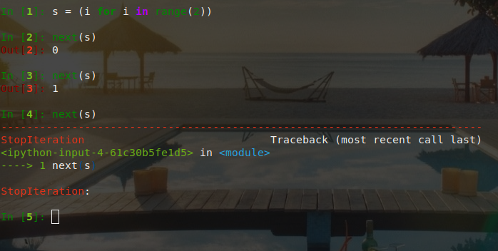

##### 可迭代、迭代器、生成器
可迭代的对象，很好理解，我们熟悉的：字符串，list，dict，tuple，deque(双向队列)等
下面使用`collections.abc`模块来验证
> 一个对象是否是可迭代的(Iterable)
> 是否是迭代器(Iterator)
> 是否是生成器(Generator)

```python
import collections
from collections.abc import Iterable,Iterator,Generator

# 字符串
str1 = 'helloPython'
print(f'字符串:{str1}')
print('可迭代的:',isinstance(str1, Iterable))
print('迭代器:',isinstance(str1, Iterator))
print('生成器:',isinstance(str1, Generator))

print('-------------------------------------------')

#列表
list1 = [1,2,3,4]
print(f'列表:{list1}')
print('可迭代的:',isinstance(list1, Iterable))
print('迭代器:',isinstance(list1, Iterator))
print('生成器:',isinstance(list1, Generator))

print('-------------------------------------------')

# 字典
dict1 = {'a':1,'b':2,'c':3}
print(f'字典:{dict1}')
print('可迭代的:',isinstance(dict1, Iterable))
print('迭代器:',isinstance(dict1, Iterator))
print('生成器:',isinstance(dict1, Generator))
```
结果：
```
字符串:helloPython
可迭代的: True
迭代器: False
生成器: False
-------------------------------------------
列表:[1, 2, 3, 4]
可迭代的: True
迭代器: False
生成器: False
-------------------------------------------
字典:{'a': 1, 'b': 2, 'c': 3}
可迭代的: True
迭代器: False
生成器: False
```
从结果来看，这些可迭代对象都不是迭代器，也不是生成器。它们有一个共同点，就是它们都可以使用for来循环。这一点，大家都知道，就不去验证了

##### 迭代器
> 对比可迭代对象，迭代器其实就只是多了一个函数而已。就是__next__()，我们可以不再使用for循环来间断获取元素值。而可以直接使用next()方法来实现
> 迭代器，是在可迭代的基础上实现的。要创建一个迭代器，我们首先，得有一个可迭代对象。
现在就来看看，如何创建一个可迭代对象，并以可迭代对象为基础创建一个迭代器。

```python
from collections.abc import Iterable, Iterator, Generator

# 定义可迭代对象类
class MyObj(object):
    
    def __init__(self, num):
        self.end = num
    
    # 返回一个实现了__iter__和__next__的迭代器类的实例
    def __iter__(self):
        return MyObjIterator(self.end)
    

# 定义迭代器类
class MyObjIterator(object):
    
    def __init__(self, end):
        self.data = end
        self.start = 0
    
    # 返回该对象的迭代器类的实例；因为自己就是迭代器，所以返回self
    def __iter__(self):
        return self
    
    # 迭代器实现的方法
    def __next__(self):
        while self.start < self.data:
            self.start += 1
            return self.start - 1
        raise StopIteration
        
        
if __name__ == '__main__':
    # 得到一个可迭代对象
    my_list = MyObj(5)
    print(isinstance(my_list, Iterable))  # True
    print(isinstance(my_list, Iterator))  # False
    
    # 迭代
    for i in my_list:
        print(i)
    
    # 得到一个迭代器
    my_iterator = iter(my_list)  
    print(isinstance(my_iterator, Iterable))  # True
    print(isinstance(my_iterator, Iterator))  # True
    
    
    print(next(my_iterator))
    print(next(my_iterator))
    print(next(my_iterator))
    print(next(my_iterator))
    print(next(my_iterator))
```
结果：
```
True
False
0
1
2
3
4
True
True
0
1
2
3
4
```

**简单的代码理解**
```python
from collections.abc import Iterator

# 创建字符串，它是可迭代对象
str1 = 'abcd'  
# 通过iter()，将可迭代对象转换为一个迭代器
aIterator = iter(str1)  
print(isinstance(aIterator, Iterator))  # True
print(next(aIterator))  # a
print(next(aIterator))  # b
print(next(aIterator))  # c
print(next(aIterator))  # d
```

##### 生成器
生成器的概念在 Python 2.2 中首次出现
> 前面说的迭代器，是在可迭代的基础上，加了一个next()方法
> 而生成器，则是在迭代器的基础上（可以用for循环，可以使用next()），再实现了yield

**yield：意为让步**
它相当于我们函数里的return。在每次next()，或者for遍历的时候，都会yield这里将新的值返回回去，并在这里阻塞，等待下一次的调用。正是由于这个机制，才使用生成器在Python编程中大放异彩。实现节省内存，实现异步编程

创建生成器的常见方法
- 使用列表生成式
```python
# 列表生成式，注意是(),而不是[]
s = (i*i for i in range(10))
print(isinstance(s, Generator))  # True
```
- 实现yield函数
```python
def mygen(i):
    num = 0
    while num < i:
        yield num
        num += 1
        
if __name__ == '__main__':
    gen = mygen(5)
    print(isinstance(gen,Generator))  # True
```
> 可迭代对象和迭代器，是将所有的值都生成存放在内存中，而生成器则是需要元素才临时生成，节省时间，节省空间

##### 运行/激活生成器
上面说道，生成器并不是一次生成所有元素，而是一次一次的执行返回

激活主要有两个方法：
- 使用`next()`
- 使用`generator.send(None)`
```python
def mygen(i):
    num = 0
    while num < i:
        yield num
        num += 1
        
if __name__ == '__main__':
    gen = mygen(4)
    # next()
    print(next(gen))
    print(next(gen))
    # generator.send(None)
    print(gen.send(None))
    print(gen.send(None))

```
结果：
```
0
1
2
3
```
##### 生成器的执行状态
生成器在其生命周期中，会有如下四个状态
- 等待开始执行：`GEN_CREATED`
- 解释器正在执行（只有在多线程应用中才能看到这个状态）：`GEN_RUNNING`
- 在yield表达式处暂停：`GEN_SUSPENDED`
- 执行结束：`GEN_CLOSED`

```python
from inspect import getgeneratorstate

def mygen(i):
    num = 0
    while num < i:
        yield num
        num += 1

if __name__ == '__main__':
    gen = mygen(2)
    print(getgeneratorstate(gen))

    print(next(gen))
    print(getgeneratorstate(gen))

    print(next(gen))
    gen.close()  # 手动关闭/结束生成器
    print(getgeneratorstate(gen))
```
结果：
```
GEN_CREATED
0
GEN_SUSPENDED
1
GEN_CLOSED
```
##### 生成器的异常处理
在生成器工作过程中，若生成器不满足生成元素的条件，就会/应该 抛出异常（StopIteration）。



列表生成式构建的生成器，其内部已经自动帮我们实现了抛出异常这一步

自定义生成器的时候需要`raise`这个异常
```
def mygen(i):
    num = 0
    while num < i:
        yield num
        num += 1
    raise StopIteration

if __name__ == '__main__':
    gen = mygen(2)
    print(next(gen))
    print(next(gen))
    print(next(gen))
```

##### 生成器过渡到协程(yield)
协程是为非抢占式多任务产生子程序的计算机程序组件，协程允许不同入口点在不同位置暂停或开始执行程序。
> 协程和线程，有相似点，多个协程之间和线程一样，只会交叉串行执行；也有不同点，线程之间要频繁进行切换，加锁，解锁，从复杂度和效率来看，和协程相比，这确是一个痛点。协程通过使用 yield 暂停生成器，可以将程序的执行流程交给其他的子程序，从而实现不同子程序的之间的交替执行。

```python
def foo(n):
    i = 0
    while i < n:
        # 通过send()发送的信息将赋值给num
        num = yield i
        if num is None:
            num = 1
        i += num

if __name__ == '__main__':
    itr = foo(5)
    print(next(itr))
    # 如果正常将里面的元素拿出来顺序是：0 1 2 3 4
    print(itr.send(2)) # 直接跳过了1
    print(next(itr))
    print(itr.send(-1))
	
```
结果：
```
0
2
3
2
```

**重点：`num = yield i`**
- `yield i`：将`i` `return`给外部调用
- `num = yield`可以接受外部程序通过`send()`发送的信息，并赋值给`num` 