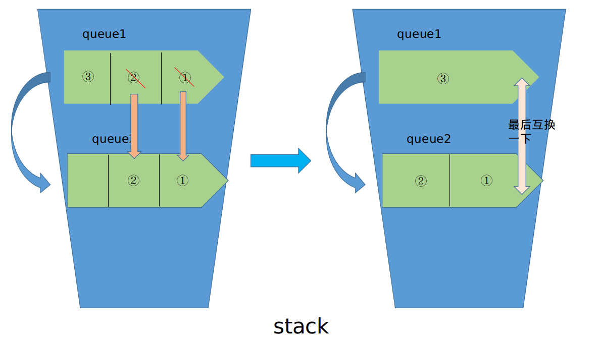
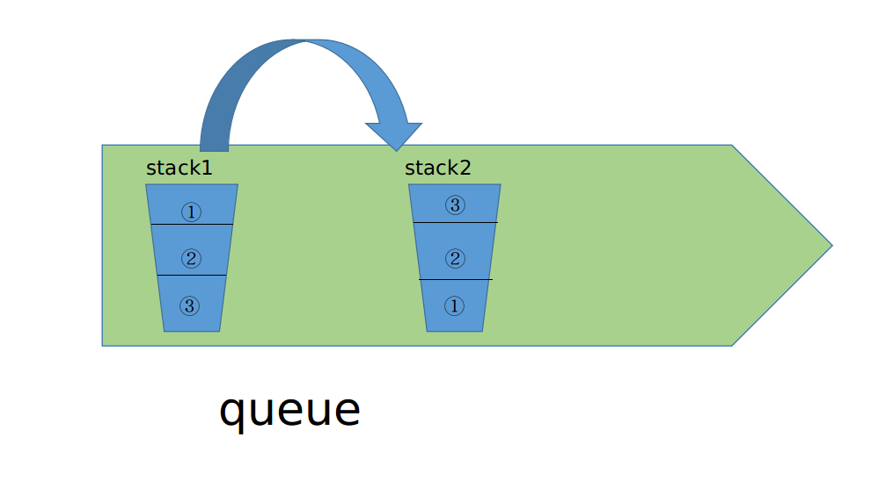

#### 队列（queue）
- 队列是一种先进先出（First in First Out）的线性表，简称FIFO
- Python中实现

```python
# queue 先进先出

class Queue(object):
    
    def __init__(self,size):
        self.size = size # 容器大小
        self.queue = [] 
        
    def q_push(self,item):
        if len(self.queue) < self.size:
            self.queue.append(item)
        else:
            raise Exception('queue is pull')
        
    def q_pop(self):
        if not self.queue:
            raise Exception('queue is empty')
        return self.queue.pop(0)
        
    def is_empty(self):
        return self.queue == []
    
    def is_full(self):
        return len(self.queue) == self.size
    


if __name__ == '__main__':
    q = Queue(5)
    for num in range(5):
        q.q_push(num)
    print(f'queue中的元素：{q.queue}')
    
    for _ in range(5):
        print(f'取出：{q.q_pop()}',end=",")
```
**结果**
```
queue中的元素：[0, 1, 2, 3, 4]
取出：0,取出：1,取出：2,取出：3,取出：4,
```


#### 栈 （stack）
- 栈（stack）是限定在表尾进行插入和删除的操作的线性表。
- 栈又称为后进先出（Last In First Out）的线性表，简称LIFO结构

```python
class Stack(object):
    
    def __init__(self,size):
        self.size = size
        self.stack = []
        
    def s_push(self,item):
        if self.is_full():
            raise Exception('stack is full')
        else:
            self.stack.append(item)
            
    def s_pop(self):
        if self.is_empty():
            raise Exception('stack is empty')
        else:
            return self.stack.pop()
         
    def is_empty(self):
        return self.stack == []
    
    def is_full(self):
        return len(self.stack) == self.size
    
    
        

if __name__ == '__main__':
    s = Stack(5)
    for num in range(5):
        s.s_push(num)
    print(f'queue中的元素：{s.stack}')
    
    for _ in range(5):
        print(f'出栈：{s.s_pop()}',end=",")
```
**结果**
```
stack中的元素：[0, 1, 2, 3, 4]
出栈：4,出栈：3,出栈：2,出栈：1,出栈：0,
```

#### 栈和队列的相互转换

##### queue ——> stack



```python
# 两个queue实现stack
class My_stack(object):
    
    def __init__(self,size):
        self.queue1 = Queue(size)
        self.queue2 = Queue(size)
        
    def my_stack_push(self,item):
        self.queue1.q_push(item)
        
    def my_stack_pop(self):
        
        if self.queue1.is_empty():
            return None
        
        while len(self.queue1.queue) != 1:
            self.queue2.q_push(self.queue1.q_pop())
        self.queue1.queue,self.queue2.queue = self.queue2.queue,self.queue1.queue
        
        return self.queue2.q_pop()
    

        
if __name__ == '__main__':
    my_s = My_stack(5)
    for num in range(5):
        my_s.my_stack_push(num)
    
    # 先取出三个
    for _ in range(3):
        print(f'出栈：{my_s.my_stack_pop()}',end=",")
    
    # 再加入三个
    for num in range(10,21,5):
        my_s.my_stack_push(num)
        
    for _ in range(5):
        print(f'出栈：{my_s.my_stack_pop()}',end=",")

```
**结果**
```
出栈：4,出栈：3,出栈：2,出栈：20,出栈：15,出栈：10,出栈：1,出栈：0,
```

##### stack ——> queue



```python
# 两个stack实现queue

class My_queue(object):
    
    def __init__(self,size):
        self.stack1 = Stack(size)
        self.stack2 = Stack(size)
        
    def my_queue_push(self,item):
        self.stack1.s_push(item)
        
    def my_queue_pop(self):
        if not self.stack2.is_empty():
            return self.stack2.s_pop()
        else:
            while self.stack1.stack:
                self.stack2.s_push(self.stack1.s_pop())
            return self.stack2.s_pop()


if __name__ == '__main__':
    my_q = My_queue(5)
    for num in range(5):
        my_q.my_queue_push(num)
    
    # 先取出三个
    for _ in range(3):
        print(f'取出：{my_q.my_queue_pop()}',end=",")
    
    # 再加入三个
    for num in range(10,21,5):
        my_q.my_queue_push(num)
        
    for _ in range(5):
        print(f'取出：{my_q.my_queue_pop()}',end=",")
```
**结果**
```
取出：0,取出：1,取出：2,取出：3,取出：4,取出：10,取出：15,取出：20,
```
