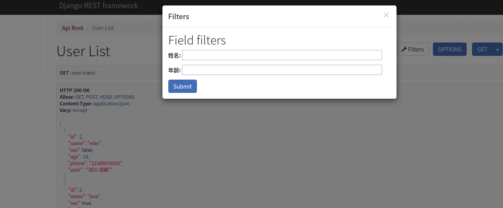
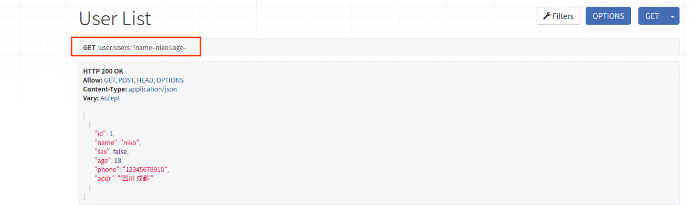
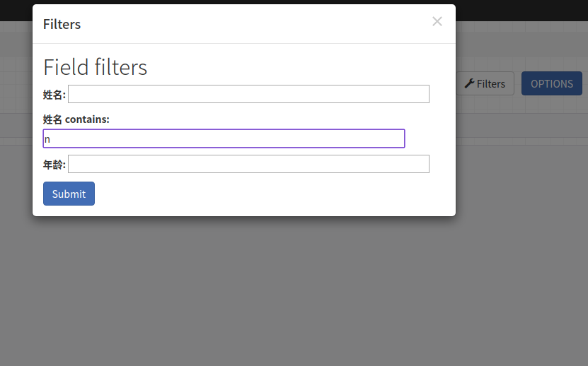
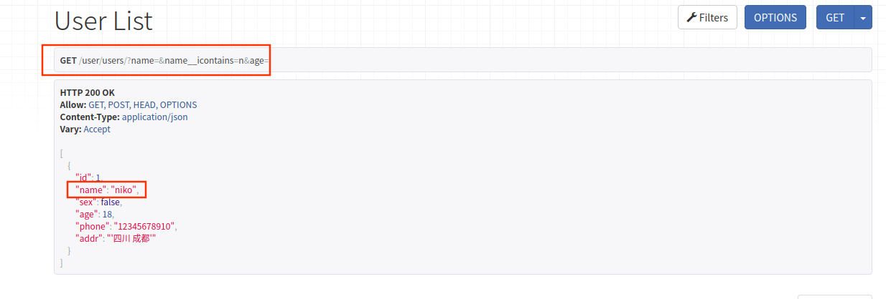

### Django-filter 使用记录

> 配合DRF食用更佳

[官网]: https://django-filter.readthedocs.io/en/master/index.html


#### 安装及注册

```
pip install django-filter
```

```python
INSTALLED_APPS = [
    ...
    'django_filters',
    ...
  
]
```


#### 示例`model`

```python
class User(models.Model):
    # 模型字段
    name = models.CharField(max_length=10, verbose_name="姓名")
    sex = models.BooleanField(default=1, verbose_name="性别")
    age = models.IntegerField(verbose_name="年龄")
    phone = models.CharField(max_length=20, null=True, verbose_name="电话")
    addr = models.CharField(max_length=100,null=True,verbose_name="地址")

    class Meta:
        db_table = "tb_user"
        verbose_name = "用户"
        verbose_name_plural = verbose_name
```


#### 过滤

##### 方式一

- 视图层直接设置过滤字段

示例：

```python
# 以name和age过滤
class UserViewSet(ModelViewSet):
    queryset = User.objects.all()
    serializer_class = UserModelSerializer
    filter_backends = (DjangoFilterBackend,)
    filter_fields = ('name', 'age')
```

- `filter_backends`  配置过滤器，也可以在`setting.py`文件全局配置

```python
# 这样
REST_FRAMEWORK = {
    'DEFAULT_FILTER_BACKENDS': ('django_filters.rest_framework.DjangoFilterBackend',) #全局默认配置过滤
    }

```

- `filter_fields`

> 设置过滤字段，这里设置了`name`和`age`


**运行服务**




> 以`name=niko`过滤




> 这里设置的是对字段的精确过滤


##### 方式二

>  新建一个`filter.py`文件

```python
import django_filters
from user.models import User

class UserFilter(django_filters.FilterSet):

    class Meta:
        model = User
        fields = ["name", "age"]
       


```

> 更改视图

```python
class UserViewSet(ModelViewSet):
    queryset = User.objects.all()
    serializer_class = UserModelSerializer
    filter_backends = (DjangoFilterBackend,)
    # filter_fields = ('name', 'age')
    filter_class = UserFilter   # 指定过滤器类
```

效果和上面一样

> more

###### 模糊过滤

```python
class UserFilter(django_filters.FilterSet):

    class Meta:
        model = User
        # fields = ["name", "age"]
        fields = {
            "name": ['exact','icontains'],
            "age": ['exact'],
        }
```

- `exact`：默认过滤方式，精确过滤
- `icontains`：模糊过滤

> 查找	`name`中有 n 的




```
GET /user/users/?name=&name__icontains=n
```



###### 范围过滤

```python
class UserFilter(django_filters.FilterSet):

    # name_mh = django_filters.CharFilter(field_name='name',lookup_expr='icontains')
    # age_gt = django_filters.NumberFilter(field_name='age', lookup_expr='gt')
    # age_lt = django_filters.NumberFilter(field_name='age', lookup_expr='lt')
    
    class Meta:
        model = User
        # fields = ["name", "age"]
        fields = {
            "name": ['exact','icontains'],
            "age": ['exact','gte','lte'],
        }

```

- 生成的过滤器
  - `name`  精确查找
  - `name__icontains`   模糊查找
  - `age`
  - `age__gte`   大于等于
  - `age__lte`   小于等于


> 列表里面就是`lookup_expr`的参数，上面的`自定义字段过滤名称`写法也可以的

```
gt    大于
gte  大于等于

lt     小于
lte  小于等于

对于日期
year__gt
month__gt
day__gt
```

> 图就不上了哈

###### 排序

```python
class UserFilter(django_filters.FilterSet):

    # name_mh = django_filters.CharFilter(field_name='name',lookup_expr='icontains')
    sort = django_filters.OrderingFilter(fields=('age',))
    # age_gt = django_filters.NumberFilter(field_name='age', lookup_expr='gt')
    # age_lt = django_filters.NumberFilter(field_name='age', lookup_expr='lt')
    class Meta:
        model = User
        # fields = ["name", "age"]
        fields = {
            "name": ['exact','icontains'],
            "age": ['exact','gte','lte'],
        }


```

> `GET /user/users/?sort=age   `:表示升序
>
> `GET /user/users/?sort=-age   `:表示降序