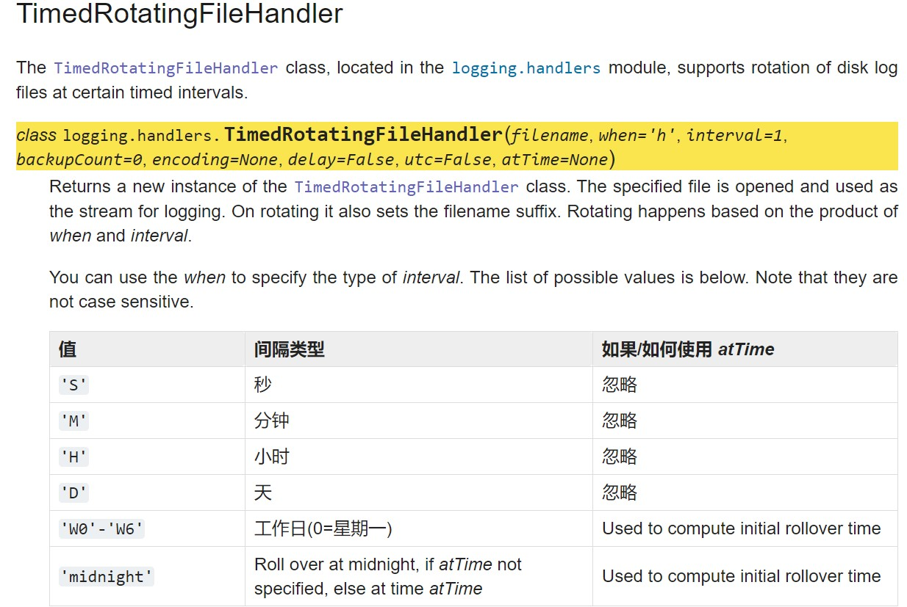

#### Flask日志使用记录

> 基础与python标准库logging   [官网](https://docs.python.org/zh-cn/3/howto/logging.html)

> 日志库采用模块化方法，并提供几类组件：记录器、处理程序、过滤器和格式化程序

##### 基本步骤

```python
# 1.实例化 Logging类
logger = logging.getLogger(__name__)
# 2.记录器 Logger.setLevel() 设置日志等级
logger.setLevel(logging.INFO)
# 3.自定义格式化formatter 
formatter = logging.Formatter('%(asctime)s - %(levelname)s - %(message)s')
# 4.输出到console/文件
  # 控制台
console_handler = logging.StreamHandler()
console_handler.setFormatter(formatter)
  # 文件
file_handler = TimedRotatingFileHandler(filename=f'{self.base_dir}/logs/{file_name}.log', when='w0',backupCount=30)
file_handler.setFormatter(formatter)
# 5.添加处理程序，可以在一个logger添加读个handler
logger.addHandler(console_handler)
logger.addHandler(file_handler)


# day日志
logger.info("log message")

```


##### 格式化

> formatter 字符串中格式自定义

```
%(levelno)s：打印日志级别的数值
%(levelname)s：打印日志级别的名称
%(pathname)s：打印当前执行程序的路径，其实就是sys.argv[0]
%(filename)s：打印当前执行程序名
%(funcName)s：打印日志的当前函数
%(lineno)d：打印日志的当前行号
%(asctime)s：打印日志的时间
%(thread)d：打印线程ID
%(threadName)s：打印线程名称
%(process)d：打印进程ID
%(message)s：打印日志信息
```


##### 处理程序

- StreamHandler

> 实例发送消息到流（类似文件对象）

- TimedRotatingFileHandler

> 实例将消息发送到硬盘文件，以特定的时间间隔轮换日志文件
>
> 


##### 示例：

> 需要打印时调用对应示例对象

```python
import logging
import os
import re
from logging.handlers import TimedRotatingFileHandler


class MyLogging():

    def __init__(self, log_name='', file_name='error'):
        self.logger = logging.getLogger(f'INTEL{log_name}')
        self.base_dir = os.path.dirname(os.path.dirname(os.path.abspath(__file__)))
        self.check_root_dir()
        self.set_log_level(file_name)
        self.formatter = logging.Formatter(
            f'|{log_name}| %(asctime)s |%(levelname)s| [funcName:%(funcName)s] [line:%(lineno)d] %(message)s')
        file_handler = TimedRotatingFileHandler(filename=f'{self.base_dir}/logs/{file_name}.log', when='w0',
                                                backupCount=30)
        # 日志保留30天，每周一自动切割
        file_handler.suffix = "%Y-%m-%d.log"
        # extMatch是编译好正则表达式，用于匹配日志文件名后缀
        # 需要注意的是suffix和extMatch一定要匹配的上，如果不匹配，过期日志不会被删除。
        file_handler.extMatch = re.compile(r"^\d{4}-\d{2}-\d{2}.log$")
        console = logging.StreamHandler()
        console.setFormatter(self.formatter)
        file_handler.setFormatter(self.formatter)
        self.logger.addHandler(console)
        self.logger.addHandler(file_handler)

    def set_log_level(self, log_level):

        if log_level == 'error':
            self.logger.setLevel(logging.ERROR)
        elif log_level == 'debug':
            self.logger.setLevel(logging.DEBUG)
        else:
            self.logger.setLevel(logging.INFO)

    def check_root_dir(self):
        path = f'{self.base_dir}/logs'
        if not os.path.exists(path):
            os.makedirs(path)


my_request_log = MyLogging(log_name='REQUEST',file_name='requests')
my_info_log = MyLogging(log_name='INFO',file_name='info')
my_error_log = MyLogging(log_name='ERROR',file_name='error')
```

