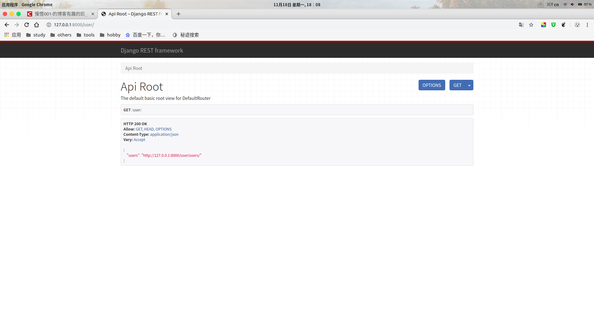
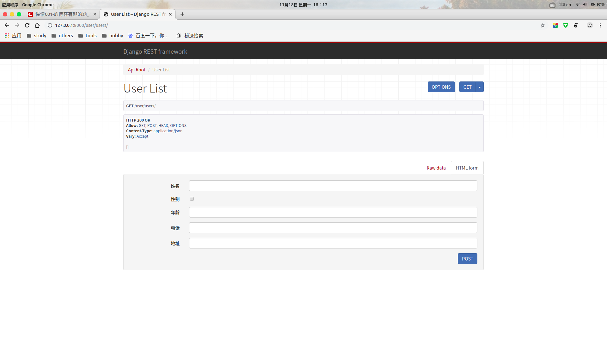
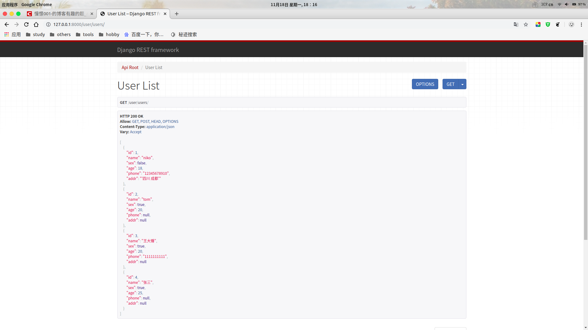
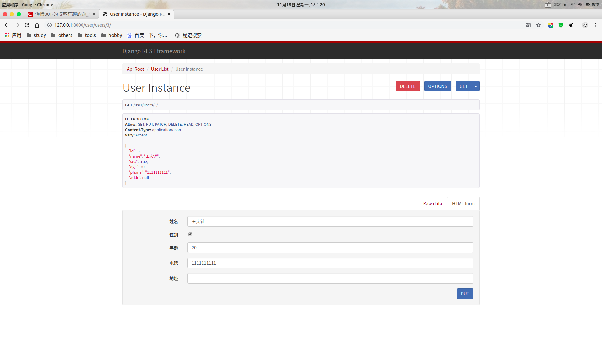

#### drf使用记录(一) drf初体验

drf(Django REST framework)


**下面简单体验一下drf**

```
需要的包
django
djangorestframework
pymysql
```

##### 创建django项目

`django-admin startproject drf_demo`

在`settings.py`的**INSTALLED_APPS**中添加'rest_framework'。

```python
INSTALLED_APPS = [
    ...
    'rest_framework',
]
```


##### 创建一个`user`应用
`python manage.py startapp user`

把`user`子应用添加到INSTALL_APPS中

```
INSTALLED_APPS = [
    ...
    'rest_framework',
    'user',
]
```

在`drf_demo`的`__init__`中设置`pymysql`为数据库驱动

```python
import pymysql

pymysql.install_as_MySQLdb()
```


- **PS**

> `pymysql`适用于`Django2.2`之前，2.2之后的推荐使用`mysqlclient`,否则就要修改部分源码

```
pip install mysqlclient
```

`drf_demo`的`__init__`就这样设置

```python
# django2.2以后
import MySQLdb
```


`settings.py`中数据库相关配置

```python
DATABASES = {
    # 'default': {
    #     'ENGINE': 'django.db.backends.sqlite3',
    #     'NAME': os.path.join(BASE_DIR, 'db.sqlite3'),
    # },
    'default': {
        'ENGINE': 'django.db.backends.mysql',
        'NAME': "drf_demo",
        "HOST": "127.0.0.1",
        "PORT": 3306,
        "USER": "root",
        "PASSWORD":"123456",
    },
}
```

##### 创建模型操作类

```python
from django.db import models

# Create your models here.

class User(models.Model):
    # 模型字段
    name = models.CharField(max_length=10, verbose_name="姓名")
    sex = models.BooleanField(default=1, verbose_name="性别")
    age = models.IntegerField(verbose_name="年龄")
    phone = models.CharField(max_length=20, null=True, verbose_name="电话")
    addr = models.CharField(max_length=100,null=True,verbose_name="地址")

    class Meta:
        db_table = "tb_user"
        verbose_name = "用户"
        verbose_name_plural = verbose_name

```


##### 创建数据库

`create database drf_demo default charset=utf8;`

##### 模型迁移生成数据表格

`python manage.py makemigrations`

`python manage.py migrate`


##### 创建序列化器

在`user`应用目录中新建`serializers.py`用于保存该应用的序列化器。

创建一个`UserModelSerializer`用于序列化与反序列化。

```python
from rest_framework import serializers
from user.models import User


# 创建序列化器类，视图中被调用
class UserModelSerializer(serializers.ModelSerializer):
    class Meta:
        model = User
        fields = "__all__"
```


##### 编写视图

`user`应用中的`views.py`

```python
from rest_framework.viewsets import ModelViewSet
from .models import User
from .serializers import UserModelSerializer


class UserViewSet(ModelViewSet):
    queryset = User.objects.all()
    serializer_class = UserModelSerializer
```

- **queryset** 指明该视图集在查询数据时使用的查询集
- **serializer_class** 指明该视图在进行序列化或反序列化时使用的序列化器

##### 定义路由

`user`应用中创建一个`urls.py`

```python
from . import views
from rest_framework.routers import DefaultRouter

# 路由列表
urlpatterns = []

router = DefaultRouter()  # 可以处理视图的路由器
router.register('users', views.UserViewSet)  # 向路由器中注册视图集

urlpatterns += router.urls  # 将路由器中的所以路由信息追到到django的路由列表中
```

- 总路由配置`def_demo`中的`urls.py`
```python
from django.contrib import admin
from django.urls import path, include

urlpatterns = [
    path('admin/', admin.site.urls),
    path('user/', include('user.urls'))
]
```


##### 运行测试

`python manage.py runserver`

- 在浏览器中输入网址127.0.0.1:8000/user，可以看到DRF提供的API Web浏览页面：



- 点击链接127.0.0.1:8000/user/users 可以访问**获取所有数据的接口**，呈现如下页面：
- 目前数据库暂无数据，可以用下面提供的post请求添加用户



- 随便创建的



- 在浏览器中输入网址127.0.0.1:8000/user/users/3/，可以访问**获取单一学生信息的接口**（id为3的用户），呈现如下页面：



- 下面的`PUT`请求可以更新id为3的user信息
- 上面`DELETE`请求可以删除id为3的user信息

