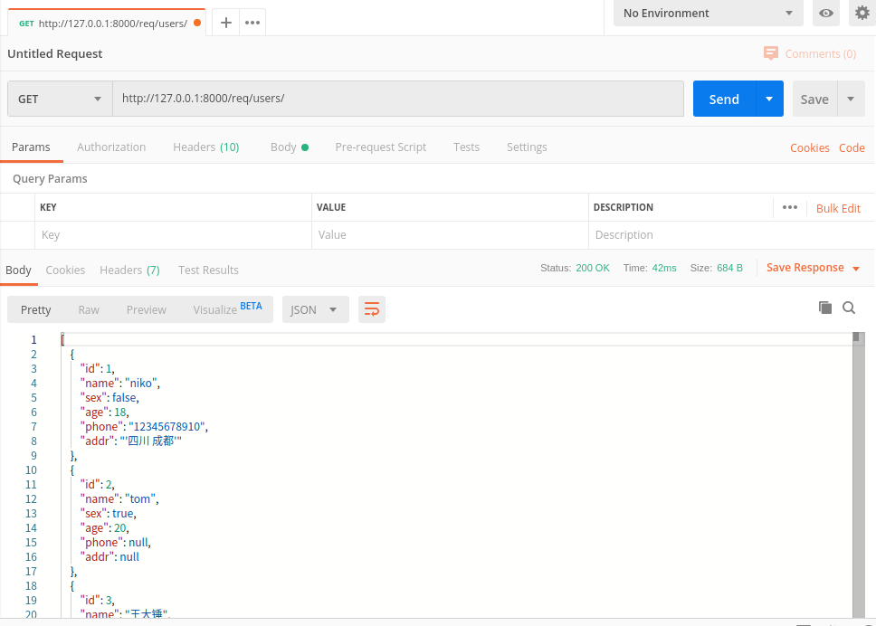
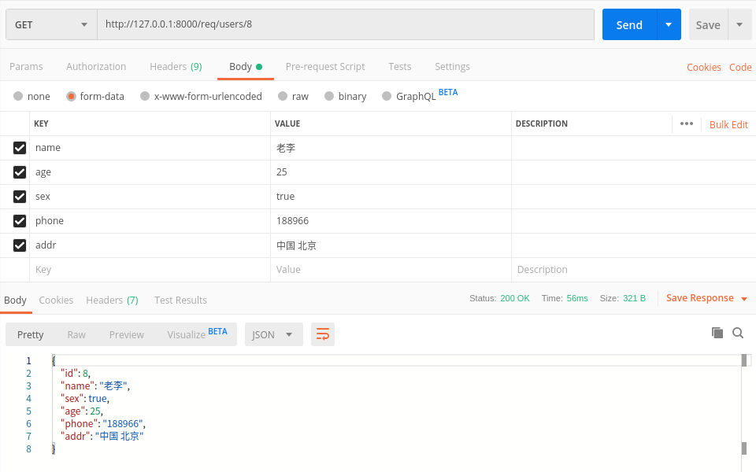
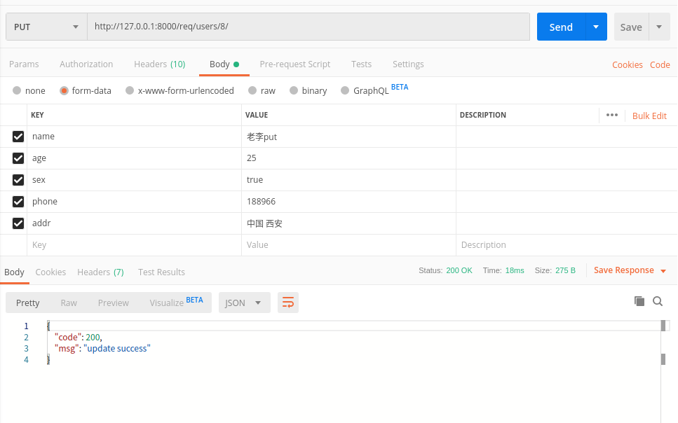
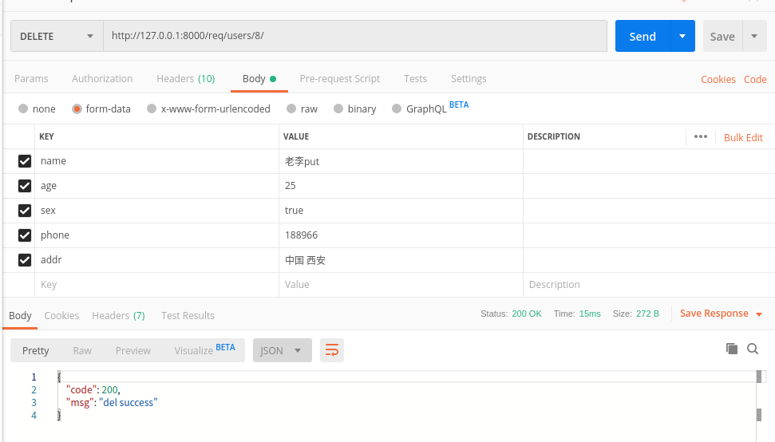
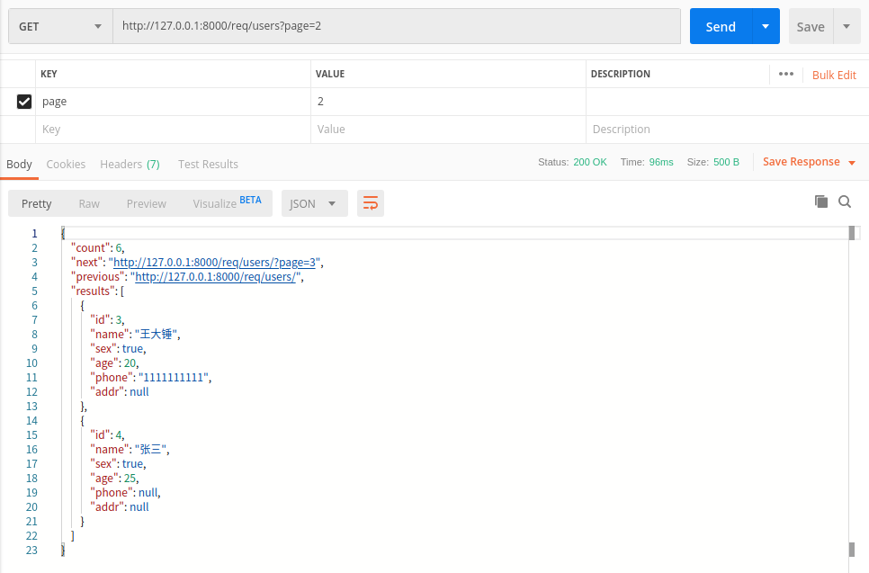

### drf使用记录(三) - 视图

#### 视图之前还忘记了点啥

##### 模型类序列化器

> `DRF`为我们提供了`ModelSerializer`模型类序列化器来帮助我们快速创建一个`Serializer`类
>
> `ModelSerializer`与常规的`Serializer`基本相同，但有所封装

- 基于模型类自动生成一系列字段
- 基于模型类自动为`Serializer`生成`validators`，比如unique_together
- 包含默认的`create()`和`update()`的实现

在`sers`应用中的`serializers.py`创建一个`UserModelSerializer`

```python
class UserModelSerializer(serializers.ModelSerializer):
    """用户数据序列化器"""
    #  继承ModelSerializer可以不用声明字段

    class Meta:
        model = User
        fields = '__all__'
```

- model ：参照哪个模型类
- fields ：为模型类的哪些字段生成

##### 字段的指定

- `fields`来明确字段，`__all__`表名包含所有字段，也可以写明具体哪些字段，如

```python
class UserModelSerializer(serializers.ModelSerializer):
    """用户数据序列化器"""

    class Meta:
        model = User
        # fields = '__all__'  # 所有字段
        fields = ('name','age','sex')
```

- `exclude`排除掉哪些字段

```python
class UserModelSerializer(serializers.ModelSerializer):
    """用户数据序列化器"""

    class Meta:
        model = User
       exclude = ('phone','addr')
```

- **read_only_fields**指明只读字段,即仅用于序列化输出的字段

```python
class UserModelSerializer(serializers.ModelSerializer):
    """用户数据序列化器"""

    class Meta:
        model = User
        fields = '__all__'
        read_only_fields = ('phone',)
```

- `extra_kwargs`为`ModelSerializer`添加或修改原有的选项参数

```python
class UserModelSerializer(serializers.ModelSerializer):
    """用户数据序列化器"""

    class Meta:
        model = User
        fields = '__all__'
        extra_kwargs = {
            'age':{'max_value':200,'required':True},
            ...
        }
```

#### 视图相关

> `drf`除了在数据序列化部分简写代码以外，还在视图中提供了简写操作。在原有的`django.views.View`类基础上，封装了多个子类

##### 请求`Request`

- REST framework 传入视图的request对象不再是`Django`默认的`HttpRequest`对象，而是REST framework提供的扩展了`HttpRequest`类的**Request**类的对象
- EST framework 提供了**Parser**解析器，在接收到请求后会自动根据`Content-Type`指明的请求数据类型（如`JSON`、表单等）将请求数据进行parse解析，解析为类字典`[QueryDict]`对象保存到**Request**对象中
- `Request`对象的数据是自动根据前端发送数据的格式进行解析之后的结果

##### 常用属性

###### data

> `request.data` 返回解析之后的请求体数据。类似于`Django`中标准的`request.POST`和 `request.FILES`属性，但提供如下特性

- 包含了解析之后的文件和非文件数据
- 包含了对`POST`、`PUT`、`PATCH`请求方式解析后的数据
- 利用了REST framework的parsers解析器，不仅支持表单类型数据，也支持`JSON`数据

##### 状态码

REST framewrok在`rest_framework.status`模块中提供了常用状态码常量。

###### 1）信息告知 - 1xx

```python
HTTP_100_CONTINUE
HTTP_101_SWITCHING_PROTOCOLS
```

###### 2）成功 - 2xx

```python
HTTP_200_OK
HTTP_201_CREATED
HTTP_202_ACCEPTED
HTTP_203_NON_AUTHORITATIVE_INFORMATION
HTTP_204_NO_CONTENT
HTTP_205_RESET_CONTENT
HTTP_206_PARTIAL_CONTENT
HTTP_207_MULTI_STATUS
```

###### 3）重定向 - 3xx

```python
HTTP_300_MULTIPLE_CHOICES
HTTP_301_MOVED_PERMANENTLY
HTTP_302_FOUND
HTTP_303_SEE_OTHER
HTTP_304_NOT_MODIFIED
HTTP_305_USE_PROXY
HTTP_306_RESERVED
HTTP_307_TEMPORARY_REDIRECT
```

###### 4）客户端错误 - 4xx

```python
HTTP_400_BAD_REQUEST
HTTP_401_UNAUTHORIZED
HTTP_402_PAYMENT_REQUIRED
HTTP_403_FORBIDDEN
HTTP_404_NOT_FOUND
HTTP_405_METHOD_NOT_ALLOWED
HTTP_406_NOT_ACCEPTABLE
HTTP_407_PROXY_AUTHENTICATION_REQUIRED
HTTP_408_REQUEST_TIMEOUT
HTTP_409_CONFLICT
HTTP_410_GONE
HTTP_411_LENGTH_REQUIRED
HTTP_412_PRECONDITION_FAILED
HTTP_413_REQUEST_ENTITY_TOO_LARGE
HTTP_414_REQUEST_URI_TOO_LONG
HTTP_415_UNSUPPORTED_MEDIA_TYPE
HTTP_416_REQUESTED_RANGE_NOT_SATISFIABLE
HTTP_417_EXPECTATION_FAILED
HTTP_422_UNPROCESSABLE_ENTITY
HTTP_423_LOCKED
HTTP_424_FAILED_DEPENDENCY
HTTP_428_PRECONDITION_REQUIRED
HTTP_429_TOO_MANY_REQUESTS
HTTP_431_REQUEST_HEADER_FIELDS_TOO_LARGE
HTTP_451_UNAVAILABLE_FOR_LEGAL_REASONS
```

###### 5）服务器错误 - 5xx

```python
HTTP_500_INTERNAL_SERVER_ERROR
HTTP_501_NOT_IMPLEMENTED
HTTP_502_BAD_GATEWAY
HTTP_503_SERVICE_UNAVAILABLE
HTTP_504_GATEWAY_TIMEOUT
HTTP_505_HTTP_VERSION_NOT_SUPPORTED
HTTP_507_INSUFFICIENT_STORAGE
HTTP_511_NETWORK_AUTHENTICATION_REQUIRED
```

#### 视图

> `Django REST framwork `提供的视图的主要作用:

- 控制序列化器的执行（检验、保存、转换数据）
- 控制数据库查询的执行

#### 视图基类

> REST framework 提供了众多的通用视图基类与扩展类，以简化视图的编写

- 新建一个应用`req`

```
python manage.py startapp req
```

##### 1.` APIView`

> `APIView`是REST framework提供的所有视图的基类，继承自`Django`的`View`父类

```
rest_framework.views.APIView
```

`req`应用中的`views.py`

- `View`

```python
from django.views import View
from django.http import HttpResponse, JsonResponse


class UserViews(View):
    """用户View类"""

    def get(self, request):
        print(request)
        """打印效果：
        <WSGIRequest: GET '/req/users/'>  # 这是django原生提供的HttpRequest类
        """

        return HttpResponse('ok')
```

###### tips

> 引入了`drf`后

- `FBV`和`CBV`都可能会出现`Django 'WSGIRequest' object has no attribute 'data'`这个报错

> 解决办法

`FBV`模式需要从`rest_framework.decorators`导入`api_view`这个装饰器

```python
from rest_framework.decorators import api_view
@api_view
def your_views_func(request):
    ...
```

> `CBV`则不能继承`django`的中`View`
>
> 需要继承`drf`中封装的视图，例如：`APIView`

```python
from rest_framework.views import APIView

class YourViewsClass(APIView):

    def get(self, request):
    	...
```


- `APIView`

```
使用APIview提供用户信息的5个API接口
GET    /req/users/               获取全部数据
POST   /req/users/               添加数据

GET    /req/users/(?P<pk>\d+)    # 获取一条数据
PUT    /req/users/(?P<pk>\d+)    # 更新一条数据
DELETE /req/users/(?P<pk>\d+)    # 删除一条数据
```


```python
from django.views import View
from django.http import HttpResponse, JsonResponse


class UserViews(View):
    """用户View类"""

    def get(self, request):
        print(request)
        print(request.GET)
        """打印效果：
        <WSGIRequest: GET '/req/users/'>  # 这是django原生提供的HttpRequest类
        """

        return HttpResponse('ok')


from rest_framework.views import APIView
from rest_framework.response import Response
from rest_framework.status import *
from sers.serializers import UserModelSerializer
from user.models import User


class UserApiviews1(APIView):
    """用户APIView类,用于查询单个、更新、删除"""

    def get(self, request, pk):
        # 获取单个数据
        user = User.objects.get(pk=pk)
        # 数据转换[序列化过程]
        serializer = UserModelSerializer(instance=user)
        # 响应数据
        return Response(serializer.data, HTTP_200_OK)

    def put(self, request, pk):
        """在更新中调用序列化器完成数据的更新操作"""
        user_obj = User.objects.get(pk=pk)
        # 实例化序列化器
        serializer = UserModelSerializer(instance=user_obj, data=request.data)

        serializer.is_valid(raise_exception=True)

        instance = serializer.save()
        print(f'update {instance}')

        return JsonResponse({'code': 200, 'msg': 'update success'})

    def delete(self,request,pk):
        """在更新中调用序列化器完成数据的删除操作"""
        user = User.objects.filter(id=pk).first()
        user.delete()
        print(f'删除{user}用户成功')
        return JsonResponse({'code': 200, 'msg': 'del success'})


class UserApiviews2(APIView):
    """用户APIView类,用于新增、查询全部"""

    def get(self, request):
        """新增用户"""
        print(request)
        """
        控制台：<rest_framework.request.Request object at 0x7efc8a7f7128>
        """
        data_list = User.objects.all()
        serializer = UserModelSerializer(instance=data_list, many=True)
        return Response(serializer.data)

    def post(self, request):
        """添加数据"""
        # 接受post请求数据
        data_dict = request.data
        # 调用序列化器
        serializer = UserModelSerializer(data=data_dict)
        # 验证
        serializer.is_valid(raise_exception=True)

        # 反序列化，保存数据
        serializer.save()

        # 响应数据
        return Response(serializer.data, HTTP_200_OK)

```

- `GET   /req/users/  `：查询所有数据



- `POST  /req/users/`：新增数据
 

- `GET /req/users/8/`: 查询单个



- `PUT /req/users/8/`: 更新`id=8`的用户信息



- `DELETE /req/users/8/`: 删除`id=8`的用户



##### 2.`GenericAPIView`[通用视图类]

```
rest_framework.generics.GenericAPIView
```

继承自`APIVIew`，**主要增加了操作序列化器和数据库查询的方法，作用是为下面`Mixin`扩展类的执行提供方法支持。通常在使用时，可搭配一个或多个`Mixin`扩展类。**

提供的关于序列化器使用的属性与方法

- 属性：

  - `serializer_class `指明视图使用的序列化器

- 方法：

  - `get_serializer_class(self)`

    当出现一个视图类中调用多个序列化器时,那么可以通过条件判断在`get_serializer_class`方法中通过返回不同的序列化器类名就可以让视图方法执行不同的序列化器对象了。

    返回序列化器类，默认返回`serializer_class`，可以重写，例如：

    ```python
    def get_serializer_class(self):
        if  条件 :
            return Serializer1
        return Serializer2
    ```

  - ##### `get_serializer(self, *args, \**kwargs)`

    返回序列化器对象，主要用来提供给`Mixin`扩展类使用，如果我们在视图中想要获取序列化器对象，也可以直接调用此方法。

    **注意，该方法在提供序列化器对象的时候，会向序列化器对象的context属性补充三个数据：request、format、view，这三个数据对象可以在定义序列化器时使用。**

    - **request** 当前视图的请求对象
    - **view** 当前请求的类视图对象
    - format 当前请求期望返回的数据格式

提供的关于数据库查询的属性与方法

- 属性：

  - `queryset` 指明使用的数据查询集

- 方法：

  - `get_queryset(self)`

    返回视图使用的查询集，主要用来提供给`Mixin`扩展类使用，是列表视图与详情视图获取数据的基础，默认返回`queryset`属性，可以重写，例如：

    ```python
    def get_queryset(self):
        user = self.request.user
        ...
        return # 你的自定义对象
    ```

  - **get_object(self)**

    返回详情视图所需的模型类数据对象，主要用来提供给`Mixin`扩展类使用。

    在试图中可以调用该方法获取详情信息的模型类对象。

    **若详情访问的模型类对象不存在，会返回404。**

    该方法会默认使用`APIView`提供的`check_object_permissions`方法检查当前对象是否有权限被访问。


其他可以设置的属性

- `pagination_class`指明分页控制类
- `filter_backends` 指明过滤控制后端


> 还是以增删改查的形式

```python
from rest_framework.generics import GenericAPIView


class UserGenericAPIView2(GenericAPIView):
    queryset = User.objects.all()  # 当前视图类中操作的公共数据，先从数据库查询出来
    serializer_class = UserModelSerializer  # 设置类视图中所有方法共有调用的视图类

    def get(self, request):
        """获取所有数据"""
        # 获取模型数据
        user_list = self.get_queryset()
        # 调用序列化器
        serializer = self.get_serializer(instance=user_list, many=True)

        return Response(serializer.data, HTTP_200_OK)

    def post(self, request):
        """添加数据"""
        # 获取客户端提交的数据
        serializer = self.get_serializer(data=request.data)
        # 使用序列化器进行验证
        serializer.is_valid(raise_exception=True)
        # 反序列化
        serializer.save()
        # 返回结果
        return JsonResponse({'code': 200, 'msg': 'add success'})


class UserGenericAPIView1(GenericAPIView):
    queryset = User.objects.all()
    serializer_class = UserModelSerializer

    def get(self, request, pk):  # 这里的参数名必须叫pk，否则要配置另一个名称如果不配置，则报错!
        # 报错信息：  get() got an unexpected keyword argument 'pk'
        instance = self.get_object()
        serializer = self.get_serializer(instance=instance)
        return Response(serializer.data)

    def put(self, request, pk):
        instance = self.get_object()
        # 获取客户端提交数据
        data = request.data
        # 实例化序列化器期
        serializer = self.get_serializer(instance=instance, data=data)
        # 验证
        serializer.is_valid(raise_exception=True)
        # 反序列化
        serializer.save()
        # 返回响应
        return Response(serializer.data)

    def delete(self, request, pk):
        user = User.objects.filter(id=pk).first()
        user.delete()
        print(f'删除{user}用户成功')
        return JsonResponse({'code': 200, 'msg': 'del success'})

```

> 测试略


#### 视图扩展类

- 提供了几种后端视图（对数据资源进行增删改查）处理流程的实现，如果需要编写的视图属于这五种，则视图可以通过继承相应的扩展类来复用代码，减少自己编写的代码量
- 这五个扩展类需要搭配`GenericAPIView`父类，因为五个扩展类的实现需要调用`GenericAPIView`提供的序列化器与数据库查询的方法

##### 1）`ListModelMixin`

- 列表视图扩展类，提供`list(request, *args, **kwargs)`方法快速实现列表视图，返回200状态码。

- 该`Mixin`的list方法会对数据进行过滤和分页。

源代码：

```python
class ListModelMixin(object):
    """
    List a queryset.
    """
    def list(self, request, *args, **kwargs):
        # 过滤
        queryset = self.filter_queryset(self.get_queryset())
        # 分页
        page = self.paginate_queryset(queryset)
        if page is not None:
            serializer = self.get_serializer(page, many=True)
            return self.get_paginated_response(serializer.data)
        # 序列化
        serializer = self.get_serializer(queryset, many=True)
        return Response(serializer.data)

```

举例：

```python
from rest_framework.mixins import ListModelMixin

class BookListView(ListModelMixin, GenericAPIView):
    queryset = BookInfo.objects.all()
    serializer_class = BookInfoSerializer

    def get(self, request):
        return self.list(request)

```


##### 2）`CreateModelMixin`

- 创建视图扩展类，提供`create(request, *args, **kwargs)`方法快速实现创建资源的视图，成功返回201状态码。

- 如果序列化器对前端发送的数据验证失败，返回400错误。

源代码：

```python
class CreateModelMixin(object):
    """
    Create a model instance.
    """
    def create(self, request, *args, **kwargs):
        # 获取序列化器
        serializer = self.get_serializer(data=request.data)
        # 验证
        serializer.is_valid(raise_exception=True)
        # 保存
        self.perform_create(serializer)
        headers = self.get_success_headers(serializer.data)
        return Response(serializer.data, status=status.HTTP_201_CREATED, headers=headers)

    def perform_create(self, serializer):
        serializer.save()

    def get_success_headers(self, data):
        try:
            return {'Location': str(data[api_settings.URL_FIELD_NAME])}
        except (TypeError, KeyError):
            return {}

```


##### 3）`RetrieveModelMixin`

- 详情视图扩展类，提供`retrieve(request, *args, **kwargs)`方法，可以快速实现返回一个存在的数据对象。

- 如果存在，返回200， 否则返回404。

源代码：

```python
class RetrieveModelMixin(object):
    """
    Retrieve a model instance.
    """
    def retrieve(self, request, *args, **kwargs):
        # 获取对象，会检查对象的权限
        instance = self.get_object()
        # 序列化
        serializer = self.get_serializer(instance)
        return Response(serializer.data)

```

举例：

```python
class BookDetailView(RetrieveModelMixin, GenericAPIView):
    queryset = BookInfo.objects.all()
    serializer_class = BookInfoSerializer

    def get(self, request, pk):
        return self.retrieve(request)

```


##### 4）`UpdateModelMixin`

- 更新视图扩展类，提供`update(request, *args, **kwargs)`方法，可以快速实现更新一个存在的数据对象

- 同时也提供`partial_update(request, *args, **kwargs)`方法，可以实现局部更新

- 成功返回200，序列化器校验数据失败时，返回400错误

源代码：

```python
class UpdateModelMixin(object):
    """
    Update a model instance.
    """
    def update(self, request, *args, **kwargs):
        partial = kwargs.pop('partial', False)
        instance = self.get_object()
        serializer = self.get_serializer(instance, data=request.data, partial=partial)
        serializer.is_valid(raise_exception=True)
        self.perform_update(serializer)

        if getattr(instance, '_prefetched_objects_cache', None):
            # If 'prefetch_related' has been applied to a queryset, we need to
            # forcibly invalidate the prefetch cache on the instance.
            instance._prefetched_objects_cache = {}

        return Response(serializer.data)

    def perform_update(self, serializer):
        serializer.save()

    def partial_update(self, request, *args, **kwargs):
        kwargs['partial'] = True
        return self.update(request, *args, **kwargs)

```


##### 5）`DestroyModelMixin`

- 删除视图扩展类，提供`destroy(request, *args, **kwargs)`方法，可以快速实现删除一个存在的数据对象。

- 成功返回204，不存在返回404。

源代码：

```python
class DestroyModelMixin(object):
    """
    Destroy a model instance.
    """
    def destroy(self, request, *args, **kwargs):
        instance = self.get_object()
        self.perform_destroy(instance)
        return Response(status=status.HTTP_204_NO_CONTENT)

    def perform_destroy(self, instance):
        instance.delete()

```


##### 视图代码：

```python

"""GenericAPIView结合视图扩展类实现api接口"""
from rest_framework.mixins import ListModelMixin, CreateModelMixin


# 声明分页的配置类
from rest_framework.pagination import PageNumberPagination
class UserPageNumberPagination(PageNumberPagination):
    # 默认每一页显示的数据量
    page_size = 2
    # 允许客户端通过get参数来控制每一页的数据量
    page_size_query_param = "size"
    max_page_size = 10
    # 自定义页码的参数名
    page_query_param = "page"

class UserMiXinGenericAPIView2(GenericAPIView, ListModelMixin, CreateModelMixin):
    # 本次视图类中要操作的数据   [必填]
    queryset = User.objects.all()
    # 本次视图类中要调用的默认序列化器  [必填]
    serializer_class = UserModelSerializer
    # 分页器
    pagination_class = UserPageNumberPagination

    def get(self, request):
        """获取多个用户信息"""
        return self.list(request)

    def post(self, request):
        """添加用户信息"""
        return self.create(request)


from rest_framework.mixins import RetrieveModelMixin, UpdateModelMixin, DestroyModelMixin


class UserMiXinGenericAPIView1(GenericAPIView, RetrieveModelMixin, UpdateModelMixin, DestroyModelMixin):
    queryset = User.objects.all()

    serializer_class = UserModelSerializer

    # 在使用GenericAPIView视图获取或操作单个数据时,视图方法中的代表主键的参数最好是pk
    def get(self, request, pk):
        """获取一条数据"""
        return self.retrieve(request, pk)

    def put(self, request, pk):
        """更新一条数据"""
        return self.update(request, pk)

    def delete(self, request, pk):
        """删除一条数据"""
        return self.destroy(request, pk)

```


- 测试

> 分页




##### 越来越easy

- `drf`内置了一些同时继承了`GenericAPIView`和`Mixins`扩展类的视图子类，我们可以直接继承这些子类九可以生成对应的`API`接口
- 下面8行代码实现数据的`CRUD`

> `ListAPIView`    获取所有数据
>  `CreateAPIView` 添加数据

```python
from rest_framework.generics import ListAPIView, CreateAPIView

class LCUserGenericAPIView(ListAPIView, CreateAPIView):
    queryset = User.objects.all()
    serializer_class = UserModelSerializer
```

> `RetrieveAPIView`  获取一条数据
>
> `UpdateAPIView`  更新一条数据
>
> `DestorAPIView`  删除一条数据

- `RetrieveUpdateDestoryAPIView`  上面三个的缩写

```python
from rest_framework.generics import RetrieveUpdateDestroyAPIView

class UserRetrieveUpdateDestroyAPIView(RetrieveUpdateDestroyAPIView):
    queryset = User.objects.all()
    serializer_class = UserModelSerializer
```

> 是不是发现了什么


##### 当然

- ８行代码，一半重复
- 查询所有数据、添加数据是不需要声明`pk`逐渐的，而其他的接口需要**[路由冲突了]**
- 查询所有数据和查询一条数据，都是属于`get`请求**[请求方法冲突了]**

```python
from rest_framework.mixins import CreateModelMixin, ListModelMixin, RetrieveModelMixin, UpdateModelMixin,  DestroyModelMixin
from rest_framework.viewsets import GenericViewSet

class UserModelViewSet1(GenericViewSet, CreateModelMixin, ListModelMixin, RetrieveModelMixin, UpdateModelMixin,  DestroyModelMixin):
    queryset = User.objects.all()
    serializer_class = UserModelSerializer
```

> 或者这样，和记录(一)中的一样

```python
# 4行代码
from rest_framework.viewsets import ModelViewSet

class UserModelViewSet1(ModelViewSet):
    queryset = User.objects.all()
    serializer_class = UserModelSerializer
```

> 路由除了记录一那种方式，还可以这样

```python
urlpatterns = [
	...
    path("users/", views.UserModelViewSet1.as_view({"get": "list", "post": "create"})),
    re_path("users/(?P<pk>\d+)/",
            views.UserModelViewSet1.as_view({"get": "retrieve", "put": "update", "delete": "destroy"}))
]

```


##### 测试

> 略