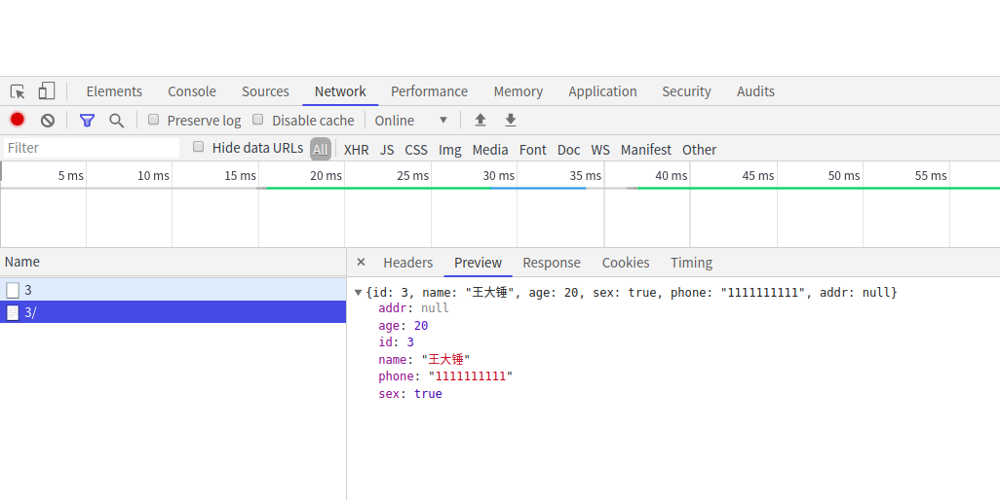
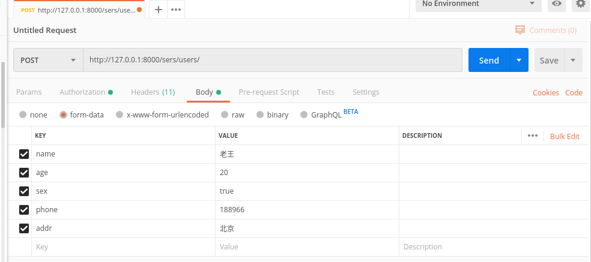
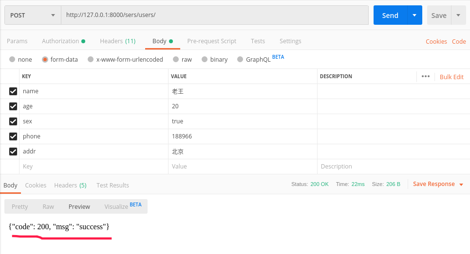
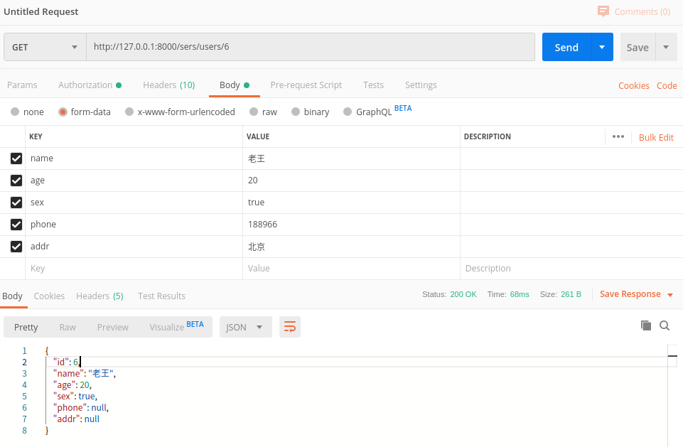
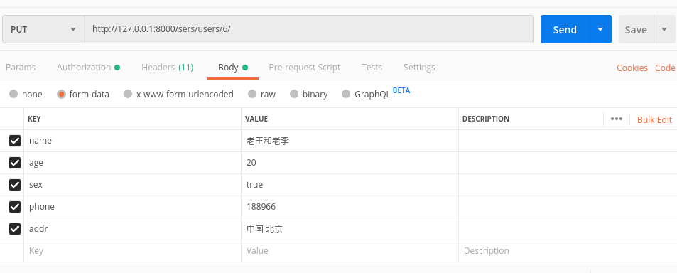
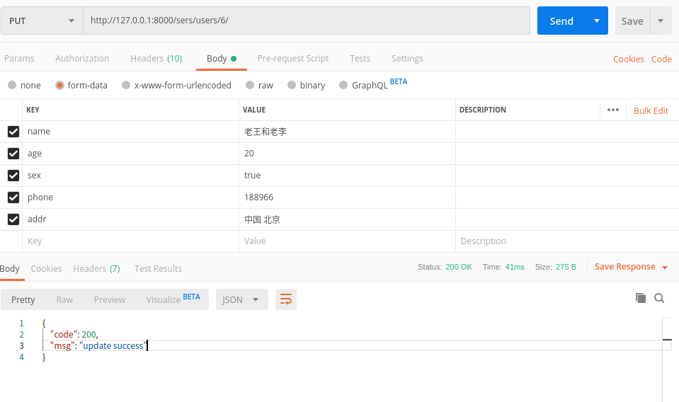
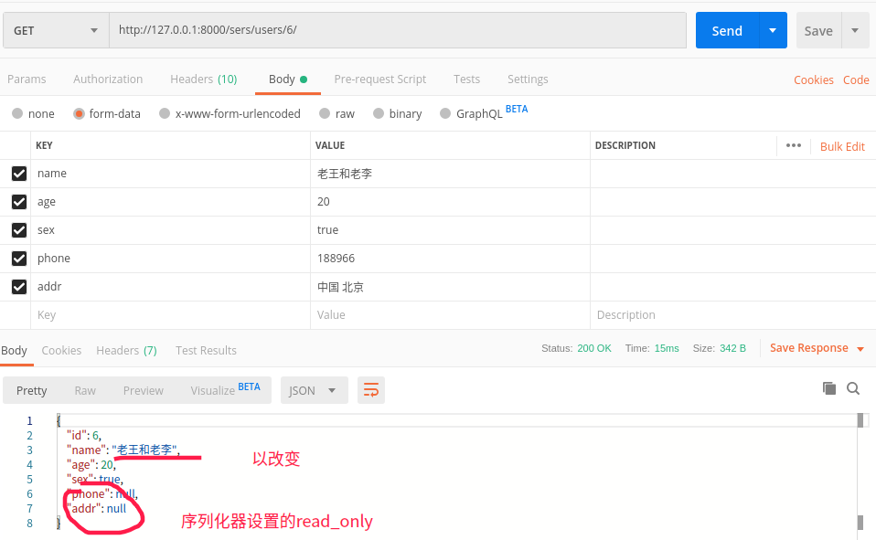

### drf使用记录(二) - 序列化器
#### 简述

- `序列化`：序列化器会把模型对象转换成字典,经过`response`以后变成`json`字符串
- `反序列化`：把客户端发送过来的数据,经过`request`以后变成字典,序列化器可以把字典转成模型
**即**
- 在客户端请求时，使用序列化器可以完成对数据的反序列化
- 在服务器响应时，使用序列化器可以完成对数据的序列化

#### 序列化
##### 定义序列化器
`Django REST framework`中的`Serializer`使用类来定义，须继承自`rest_framework.serializers.Serializer`

#####  创建一个新应用`sers`
`python manage.py startapp sers`
 模型就用`user`那个吧

##### 创建序列化器
- 在`sers`应用中创建一个`serializers.py`
```python
from rest_framework import serializers


# 声明序列化器，所有的序列化器都要直接或者间接继承于 Serializer
# 其中，ModelSerializer是Serializer的子类，ModelSerializer在Serializer的基础上进行了代码简化
class UserSerializer(serializers.Serializer):
    """用户信息序列化器"""
    # 1. 需要进行数据转换的字段
    id = serializers.IntegerField()
    name = serializers.CharField()
    age = serializers.IntegerField()
    sex = serializers.BooleanField()
    phone = serializers.CharField()
    addr = serializers.CharField()
```

##### 使用`Serializer`

`Serializer(instance=None, data=empty, **kwarg)`

说明：

- `instance`：序列化时，传入模型对象
- `data`：反序列化时，传入反序列化的数据(`dict`)
- 除了`instance`和`data`参数外，在构造`Serializer`对象时，还可通过`context`参数额外添加数据

如：`serializer = UserSerializer(user, context={'key': value})`

##### 编写视图

在`sers`应用中的`views.py`
```python
from django.views import View
from user.models import User
from .serializers import UserSerializer
from django.http.response import JsonResponse


class UserView1(View):
    """使用序列化器序列化转换单个模型数据"""

    def get(self, request, pk):
        # 获取单个数据
        student = User.objects.get(pk=pk)
        # 数据转换[序列化过程]
        serializer = UserSerializer(instance=student)
        print(serializer.data)
        # 响应数据
        return JsonResponse(serializer.data)


class UserVie2(View):
    """使用序列化器序列化转换多个模型数据"""

    def get(self, request):
        # 获取数据
        user_list = User.objects.all()

        # 转换数据[序列化过程]
        # 如果转换多个模型对象数据，则需要加上many=True
        serializer = UserSerializer(instance=user_list, many=True)
        print(serializer.data)  # 序列化器转换后的数据

        # 响应数据给客户端
        # 返回的json数据，如果是列表，则需要声明safe=False
        return JsonResponse(serializer.data, safe=False)

```


##### 定义路由

在`sers`应用中创建一个`urls.py`文件

```python
from django.urls import path, re_path

from sers import views

urlpatterns = [
    re_path("users/(?P<pk>\d)/", views.UserViews1.as_view()),
    path("users/", views.UserViews2.as_view()),
]
```

总路由`urlpatterns`列表加入`path('sers/', include('sers.urls')),`


##### 测试接口

- `python manage.py runserver`启动项目

- `127.0.0.1:8000/sers/users`: 获取所有用户
  

- `127.0.0.1:8000/sers/users/3`: 获取id=3的用户


#### 反序列化

- 反序列化时，需要对数据进行验证成功后，才能获取数据或保存模型类对象
- 在获取反序列化的数据前，必须调用`is_valid()`方法进行验证，验证成功返回`True`，否则返回`False`
- 验证成功，可以通过序列化器对象的`validated_data`属性获取数据
- 验证失败，可以通过序列化器对象的`errors`属性获取错误信息，返回字典，包含了字段和字段的错误。如果是非字段错误，可以通过修改REST framework配置中的`NON_FIELD_ERRORS_KEY`来控制错误字典中的键名
- 在定义序列化器时，指明每个字段的序列化类型和选项参数，本身就是一种验证行为

##### 验证之｀is_valid()｀

更改一下`UserSerializer`,增加字段限制（相关参数说明放在最下面）

```python
class UserSerializer(serializers.Serializer):
    """用户信息序列化器"""
    # 1. 需要进行数据转换的字段
    id = serializers.IntegerField(read_only=True)
    name = serializers.CharField()
    age = serializers.IntegerField()
    sex = serializers.BooleanField()
    phone = serializers.CharField(read_only=True)
    addr = serializers.CharField(read_only=True)

```


`python manage.py shell`打开交互式命令行

- 验证失败

```python
>>> from sers.serializers import UserSerializer
>>> data = {'sex':'男'}
>>> serializer = UserSerializer(data=data)
>>> serializer.is_valid()
False
>>> serializer.errors
{ 'name': [ErrorDetail(string='This field is required.', code='required')], 'age': [ErrorDetail(string='This field is required.', code='required')], 'sex': [ErrorDetail(string='Must be a valid boolean.', code='invalid')]}
>>> serializer.validated_data
{}
>>> 
```

- 验证成功

```python
>>> from sers.serializers import UserSerializer
>>> data = {'name':'张三','age':20,'sex':1}
>>> serializer = UserSerializer(data=data)
>>> serializer.is_valid()
True
>>> serializer.validated_data
OrderedDict([('name', '张三'), ('age', 20), ('sex', True)])
>>> 

```

`is_valid()`方法还可以在验证失败时抛出异常`serializers.ValidationError`，可以通过传递**raise_exception=True**参数开启，REST framework接收到此异常，会向前端返回HTTP 400 Bad Request响应。

```python
# Return a 400 response if the data was invalid.
serializer.is_valid(raise_exception=True)
```

##### 自定义验证

###### 1.` validate_字段名`

```python
class UserSerializer(serializers.Serializer):
    """用户信息序列化器"""
    # ...省略字段咯

    def validate_name(self, value):
        if 'niko'  in value.lower():
            raise serializers.ValidationError("name不能为niko")
        return value
```
**测试**

```python
>>> from sers.serializers import UserSerializer
>>> data = {'name':'张三','age':20,'sex':1}
>>> serializer = UserSerializer(data=data)
>>> serializer.is_valid()
True
>>> data = {'name':'niko','age':20,'sex':1}
>>> serializer = UserSerializer(data=data)
>>> serializer.is_valid()
False
>>> serializer.errors
{'name': [ErrorDetail(string='name不能为niko', code='invalid')]}
>>> 

```


######  2.`validate`

- 在序列化器中需要同时对多个字段进行比较验证时，可以定义`validate`方法来验证

```python
class UserSerializer(serializers.Serializer):
    """用户信息序列化器"""
    # ...省略字段咯
    
    def validate(self, attrs):
        age = attrs['age']
        sex = attrs['sex']
        if age < sex:
            raise serializers.ValidationError('age不能比sex小')
        return attrs
```

**测试**

```python
>>> from sers.serializers import UserSerializer
>>> data = {'name':'张三','age':20,'sex':1}
>>> serializer = UserSerializer(data=data)
>>> serializer.is_valid()
True
>>> data = {'name':'张三','age':0,'sex':1}
>>> serializer = UserSerializer(data=data)
>>> serializer.is_valid()
False
>>> serializer.errors
{'non_field_errors': [ErrorDetail(string='age不能比sex小', code='invalid')]}
>>> 

```

###### 3.`validators`参数

```python
def about_name(value):
    if 'drf' in value.lower():
        raise serializers.ValidationError("name不能是drf")


# 声明序列化器，所有的序列化器都要直接或者间接继承于 Serializer
# 其中，ModelSerializer是Serializer的子类，ModelSerializer在Serializer的基础上进行了代码简化
class UserSerializer(serializers.Serializer):
    """用户信息序列化器"""
    # 1. 需要进行数据转换的字段
    ...
    name = serializers.CharField(validators=[about_name])  # 可以添加多个
    ...
```

**就不测了，下一个**


##### 反序列化之数据保存

- 验证数据成功后,我们可以使用序列化器来完成数据反序列化的过程.这个过程可以把数据转成模型类对象
- 通过实现create()和update()两个方法

###### 两个方法

```python
class UserSerializer(serializers.Serializer):
    """用户信息序列化器"""
    ...

    def create(self, validated_data):
        """新建"""
        return User(**validated_data)

    def update(self, instance, validated_data):
        """更新，instance为要更新的对象实例"""
        instance.name = validated_data.get('name', instance.name)
        instance.age = validated_data.get('age', instance.age)
        instance.sex = validated_data.get('sex', instance.sex)
        instance.phone = validated_data.get('phone', instance.phone)
        instance.addr = validated_data.get('addr', instance.addr)
        return instance
```

- 如果需要在返回数据对象的时候，也将数据保存到数据库中，则可以进行如下修改

```python
class UserSerializer(serializers.Serializer):
    """用户信息序列化器"""
    ...

    def create(self, validated_data):
        """新建"""
        return User.objects.create(**validated_data)

    def update(self, instance, validated_data):
        """更新，instance为要更新的对象实例"""
        instance.name = validated_data.get('name', instance.name)
        instance.age = validated_data.get('age', instance.age)
        instance.sex = validated_data.get('sex', instance.sex)
        instance.phone = validated_data.get('phone', instance.phone)
        instance.addr = validated_data.get('addr', instance.addr)
        instance.save()
        return instance
```

###### 视图添加`post`方法

```python
from django.views import View
from user.models import User
from .serializers import UserSerializer
from django.http.response import JsonResponse
from rest_framework.views import APIView
from rest_framework.response import Response

class UserViews1(APIView):
    """使用序列化器序列化转换单个模型数据"""

    def get(self, request, pk):
        # 获取单个数据
        student = User.objects.get(pk=pk)
        # 数据转换[序列化过程]
        serializer = UserSerializer(instance=student)
        print(serializer.data)
        # 响应数据
        return JsonResponse(serializer.data)

    def put(self, request, pk):
        """在更新中调用序列化器完成数据的更新操作"""
        user_obj = User.objects.get(pk=pk)

        data_dict = self.__request_to_dict(request)
        print(data_dict)

        # 实例化序列化器
        serializer = UserSerializer(instance=user_obj, data=data_dict)

        serializer.is_valid(raise_exception=True)

        instance = serializer.save()
        print(f'update {instance}')

        return JsonResponse({'code': 200, 'msg': 'update success'})

    def delete(self, request, pk):
        """在更新中调用序列化器完成数据的删除操作"""
        user = User.objects.filter(id=pk).first()
        user.delete()
        print(f'删除{user}用户成功')
        return JsonResponse({'code': 200, 'msg': 'del success'})

    @staticmethod
    def __request_to_dict(request):
        req_data = request.data
        data_dict = {
            'name': req_data.get('name', ''),
            'age': req_data.get('age', ''),
            'sex': req_data.get('sex', ''),
            'phone': req_data.get('phone', ''),
            'addr': req_data.get('addr', ''),
        }

        return data_dict


class UserViews2(View):
    """使用序列化器序列化转换多个模型数据"""

    def get(self, request):
        # 获取数据
        user_list = User.objects.all()

        # 转换数据[序列化过程]
        # 如果转换多个模型对象数据，则需要加上many=True
        serializer = UserSerializer(instance=user_list, many=True)
        print(serializer.data)  # 序列化器转换后的数据

        # 响应数据给客户端
        # 返回的json数据，如果是列表，则需要声明safe=False
        return JsonResponse(serializer.data, safe=False)

    def post(self, request):
        data_dict = self.__request_to_dict(request)
        """在客户端提交数据的时，对数据进行验证"""
        serializer = UserSerializer(data=data_dict)

        result = serializer.is_valid(raise_exception=True)
        print(f"验证的结果： {result}")
        # 获取验证的错误信息
        if not result:
            print("错误信息： %s" % serializer.error_messages)

        # save表示让序列化器开始执行反序列化代码 create和update的代码
        user = serializer.save()

        print(f'新建用户：{user}')

        return JsonResponse({'code': 200, 'msg': 'add success'})

    @staticmethod
    def __request_to_dict(request):
        req_data = request.POST
        data_dict = {
            'name': req_data.get('name', ''),
            'age': req_data.get('age', ''),
            'sex': req_data.get('sex', ''),
            'phone': req_data.get('phone', ''),
            'addr': req_data.get('addr', ''),
        }

        return data_dict

```


###### 测试

- 注释掉`setting.py`中的`csrf`中间件 如下：

```python
MIDDLEWARE = [
    'django.middleware.security.SecurityMiddleware',
    'django.contrib.sessions.middleware.SessionMiddleware',
    'django.middleware.common.CommonMiddleware',
    # 'django.middleware.csrf.CsrfViewMiddleware',
    'django.contrib.auth.middleware.AuthenticationMiddleware',
    'django.contrib.messages.middleware.MessageMiddleware',
    'django.middleware.clickjacking.XFrameOptionsMiddleware',
]
```

- 使用`postman`接口测试工具测试

新增用户


响应


**django 控制台信息**

```
验证的结果： True
[18/Nov/2019 13:49:21] "POST /sers/users/ HTTP/1.1" 200 31
新建用户：User object (6)
```

**查一下id=6的用户**



- 更新`id=6`的用户(`put`)





**查一下`id=6`的用户**




- 删除`delete()`略


#### 常用字段类型：

##### 字段

| 字段                    | 字段构造方式                                                 |
| ----------------------- | ------------------------------------------------------------ |
| **BooleanField**        | BooleanField()                                               |
| **NullBooleanField**    | NullBooleanField()                                           |
| **CharField**           | CharField(max_length=None, min_length=None, allow_blank=False, trim_whitespace=True) |
| **EmailField**          | EmailField(max_length=None, min_length=None, allow_blank=False) |
| **RegexField**          | RegexField(regex, max_length=None, min_length=None, allow_blank=False) |
| **SlugField**           | SlugField(max*length=50, min_length=None, allow_blank=False) 正则字段，验证正则模式 [a-zA-Z0-9*-]+ |
| **URLField**            | URLField(max_length=200, min_length=None, allow_blank=False) |
| **UUIDField**           | UUIDField(format='hex_verbose')  format:  1) `'hex_verbose'` 如`"5ce0e9a5-5ffa-654b-cee0-1238041fb31a"`  2） `'hex'` 如 `"5ce0e9a55ffa654bcee01238041fb31a"`  3）`'int'` - 如: `"123456789012312313134124512351145145114"`  4）`'urn'` 如: `"urn:uuid:5ce0e9a5-5ffa-654b-cee0-1238041fb31a"` |
| **IPAddressField**      | IPAddressField(protocol='both', unpack_ipv4=False, **options) |
| **IntegerField**        | IntegerField(max_value=None, min_value=None)                 |
| **FloatField**          | FloatField(max_value=None, min_value=None)                   |
| **DecimalField**        | DecimalField(max_digits, decimal_places, coerce_to_string=None, max_value=None, min_value=None) max_digits: 最多位数 decimal_palces: 小数点位置 |
| **DateTimeField**       | DateTimeField(format=api_settings.DATETIME_FORMAT, input_formats=None) |
| **DateField**           | DateField(format=api_settings.DATE_FORMAT, input_formats=None) |
| **TimeField**           | TimeField(format=api_settings.TIME_FORMAT, input_formats=None) |
| **DurationField**       | DurationField()                                              |
| **ChoiceField**         | ChoiceField(choices) choices与Django的用法相同               |
| **MultipleChoiceField** | MultipleChoiceField(choices)                                 |
| **FileField**           | FileField(max_length=None, allow_empty_file=False, use_url=UPLOADED_FILES_USE_URL) |
| **ImageField**          | ImageField(max_length=None, allow_empty_file=False, use_url=UPLOADED_FILES_USE_URL) |
| **ListField**           | ListField(child=, min_length=None, max_length=None)          |
| **DictField**           | DictField(child=)                                            |

##### **选项参数：**

| 参数名称            | 作用             |
| ------------------- | ---------------- |
| **max_length**      | 最大长度         |
| **min_lenght**      | 最小长度         |
| **allow_blank**     | 是否允许为空     |
| **trim_whitespace** | 是否截断空白字符 |
| **max_value**       | 最小值           |
| **min_value**       | 最大值           |

##### 通用参数：

| 参数名称           | 说明                                          |
| ------------------ | --------------------------------------------- |
| **read_only**      | 表明该字段仅用于序列化输出，默认False         |
| **write_only**     | 表明该字段仅用于反序列化输入，默认False       |
| **required**       | 表明该字段在反序列化时必须输入，默认True      |
| **default**        | 反序列化时使用的默认值                        |
| **allow_null**     | 表明该字段是否允许传入None，默认False         |
| **validators**     | 该字段使用的验证器                            |
| **error_messages** | 包含错误编号与错误信息的字典                  |
| **label**          | 用于HTML展示API页面时，显示的字段名称         |
| **help_text**      | 用于HTML展示API页面时，显示的字段帮助提示信息 |