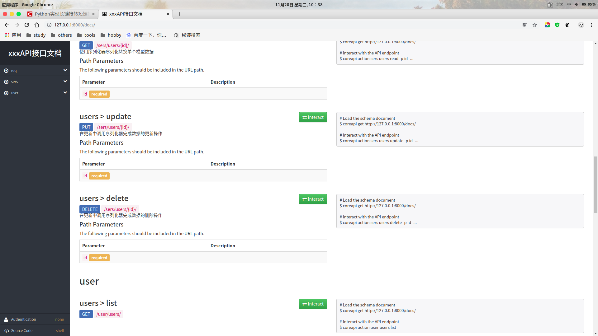

### 功能补充

#### 分页`Pagination`

##### 全局设置

`setting.py`文件

```python
REST_FRAMEWORK = {
    'DEFAULT_PAGINATION_CLASS':  'rest_framework.pagination.PageNumberPagination',
    'PAGE_SIZE': 10  # 每页数目
}
```

##### 局部设置(自定义)

###### `PageNumberPagination`分页器

- 自定义`Pagination`类
- 视图中通过`pagination_clas`属性指明

```python
class YourPagination(PageNumberPagination):
    page_size = 10
    page_size_query_param = 'size'
    max_page_size = 100
    page_query_param = "page"  # page和size参数名都可自定义
class YourlView(RetrieveAPIView):
    queryset = BookInfo.objects.all()
    serializer_class = BookInfoSerializer
    pagination_class = YourPagination # 指定分页器
```
> 访问：`GET  127.0.0.1:8000/users?page=2&size=5`

- `page_size` 每页数目
- `page_query_param` 前端发送的页数关键字名，默认为"`page`"
- `page_size_query_param` 前端发送的每页数目关键字名，默认为`None`
- `max_page_size`前端最多能设置的每页数量

- 如果在视图内关闭分页功能，只需在视图内设置

```python
pagination_class = None
```

###### `LimitOffsetPagination`分页器

```python
from rest_framework.pagination import LimitOffsetPagination
class YourPagination(LimitOffsetPagination):
    # 默认每一页查询的数据量,类似上面的page_size
    default_limit = 2
    limit_query_param = "limit"
    offset_query_param = "offset"
    max_limit = 100

class YourAPIView(ListAPIView):
    queryset = Student.objects.all()
    serializer_class = StudentModelSerializer
    pagination_class = YourPagination
```

- default_limit 默认限制，默认值与`PAGE_SIZE`设置一直
- limit_query_param limit参数名，默认'limit'
- offset_query_param offset参数名，默认'offset'
- max_limit 最大limit限制，默认None

> 访问：`GET  127.0.0.1:8000/users?offset=2&limit=5`


#### 接口文档

- `REST framework`提供了自动生成接口文档功能
- 接口文档以网页的方式呈现
- 自动接口文档能生成的是继承自`APIView`及其子类的视图

##### 安装依赖

- `REST framewrok`生成接口文档需要`coreapi`库的支持

```
pip install coreapi -i https://pypi.douban.com/simple
```

##### `settings.py`文件配置

```python
REST_FRAMEWORK = {
    'DEFAULT_SCHEMA_CLASS': 'rest_framework.schemas.AutoSchema'
}
```

##### 配置访问路由

- 在总路由中添加接口文档路径
- 文档路由对应的视图配置为`rest_framework.documentation.include_docs_urls`
- 参数`title`为接口文档网站的标题

```python
from rest_framework.documentation import include_docs_urls

urlpatterns = [
    ...
    path('docs/', include_docs_urls(title='xxxAPI接口文档'))
]
```

##### 文档说明定义

- 单一方法的视图，可直接使用类视图的文档字符串

```python
class UserListView(generics.ListAPIView):
    """
    返回所有用户信息
    """
```

- 多个方法的视图

```python
class UserListCreateView(generics.ListCreateAPIView):
    """
    get:
    返回所有用户信息

    post:
    新建用户
    """
```

> 访问  `GET   127.0.0.1:8000/docs/`




#### `Demo`代码

[drf_demo](https://github.com/chongjing001/Python-Advance/tree/master/DemoCode/drf_demo)

#### 待续...